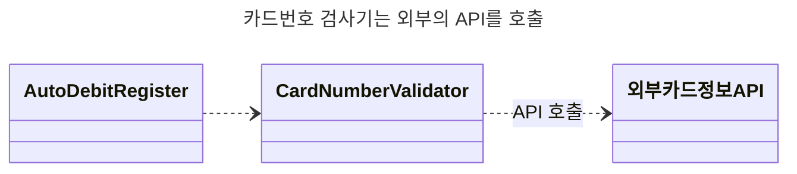
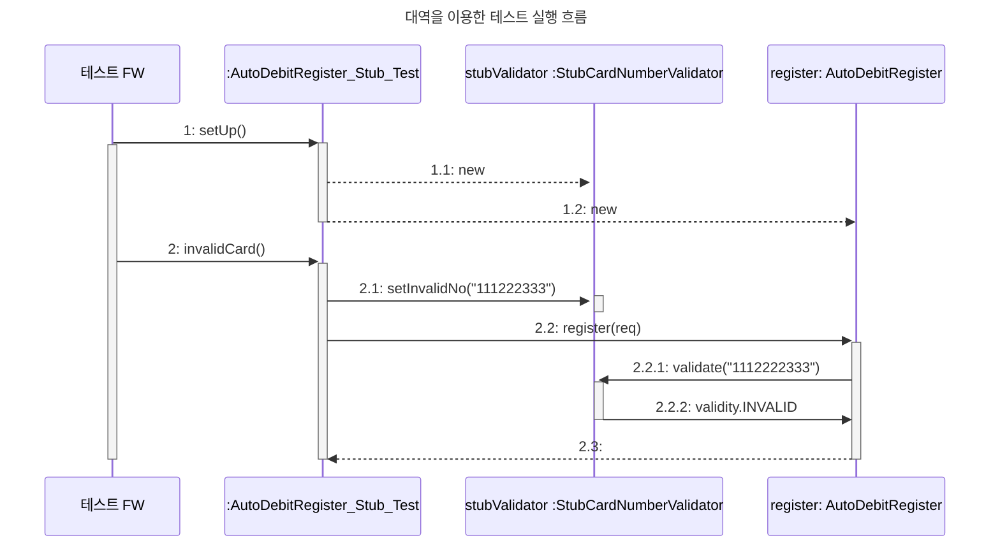
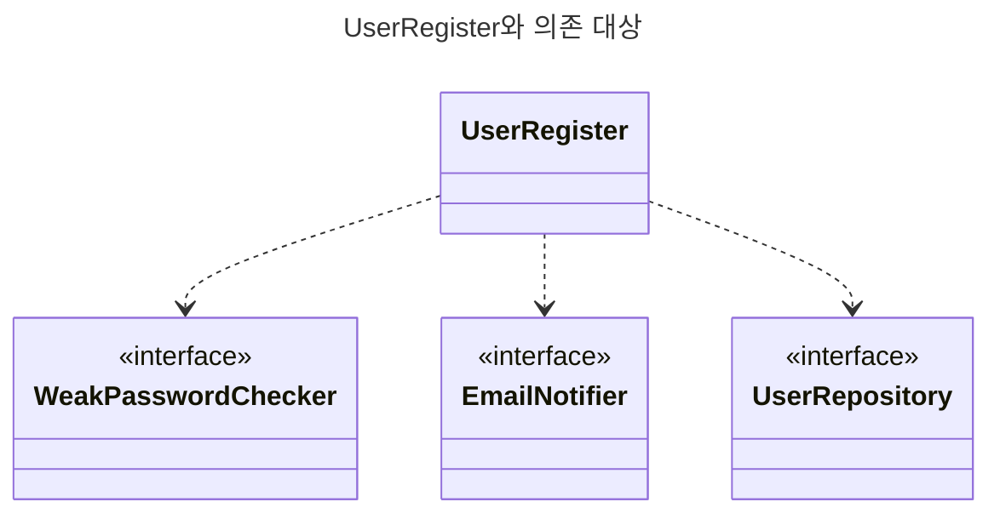
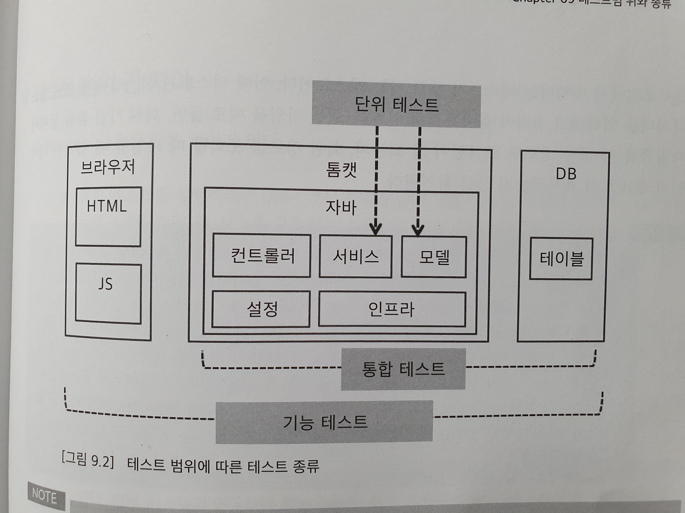
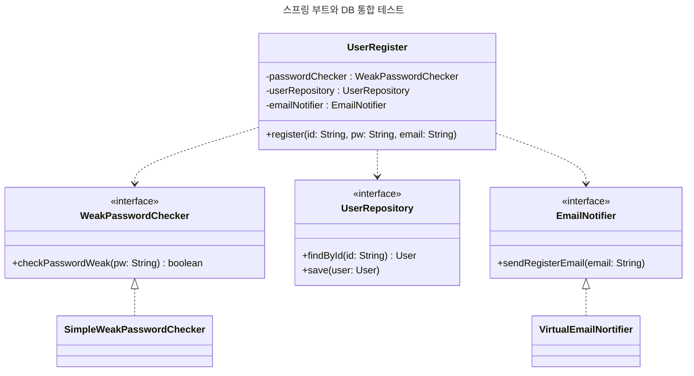
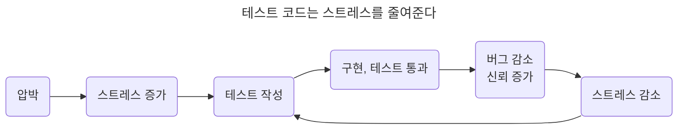
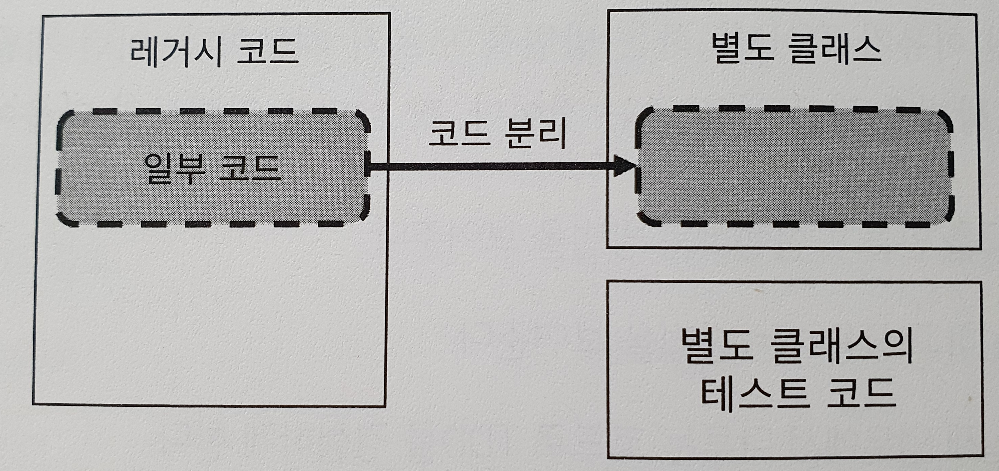
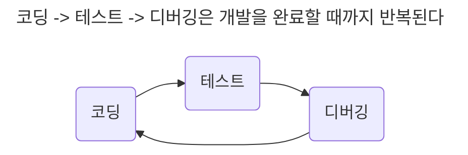
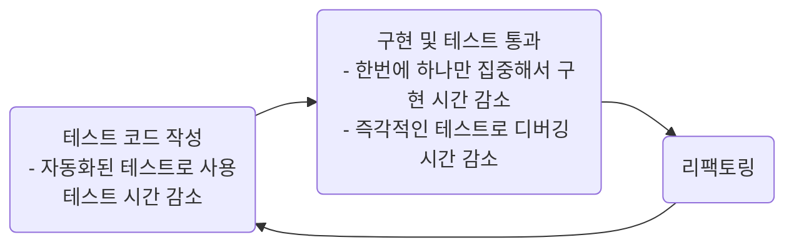

# 테스트 주도 개발 시작하기

---

## To Do
- [X] Chapter 1. TDD 개발 준비
- [X] Chapter 2. TDD 시작
- [X] Chapter 3. 테스트 코드 작성 순서
- [X] Chapter 4. TDD • 기능 명세 • 설계
- [X] Chapter 5. Junit 5 기초
- [X] Chapter 6. 테스트 코드의 구성
- [X] Chapter 7. 대역
- [X] Chapter 8. 테스트 가능한 설계
- [X] Chapter 9. 테스트 범위와 종류
- [X] Chapter 10. 테스트 코드와 유지 보수
- [X] Chapter 11. 마치며
- [X] 부록 A. Junit 5 추가 내용
- [X] 부록 B. Junit 4 기초
- [X] 부록 C. Mockito 기초 사용법
- [X] 부록 D. AssertJ 소개


---

[TOC]

---

## Chapter 2. TDD 시작

암호 강도 측정 기능을 TDD로 구현

1. 모든 규칙을 충족하는 암호 강도는 '강함'
2. 길이만 8글자 미만이고 나머지 규칙은 충족하는 암호의 강도는 '보통'
3. 숫자를 포함하지 않고 나머지 규칙은 충족하는 암호의 강도는 '보통'
4. 값이 없는 암호의 강도는 '유효하지 않음'
5. 대문자를 포함하지 않고 나머지 규칙은 충족하는 경우
6. 길이가 8글자 이상인 규칙만 충족하는 경우
7. 숫자 포함 규칙만 충족하는 경우
8. 대문자 포함 규칙만 충족하는 경우
9. 아무 규칙도 충족하지 않는 경우

### TDD 흐름
TDD는 테스트를 먼저 작성하고 테스트 통과시킬 만큼 코드를 작성하고 리팩토링으로 마무리 하는 과정을 반복한다

> 레드-그린-리팩터
TDD 사이클을 레드(Red)-그린(Green)-리팩터(Refactor)로 부르기도 함  
여기서 레드는 실패를 의미. 레드는 테스트 코드가 실패하면 빨간색을 이용해서 실패한 테스트를 보여주는 데서 비롯함.  
비슷하게 그린은 성공한 테스트를 의미. 즉 코드를 구현해서 실패하는 테스트를 통과시키는 것을 뜻함.  
마지막으로 리팩터는 이름 그대로 리팩토링 과정을 의미함.

### 테스트가 개발을 주도
테스트 코드를 먼저 작성하면 테스트가 개발을 주도하게 된다  

- 가장 먼저 통과해야할 테스트 작성
- 테스트를 작성하는 과정에서 구현을 생각하지 않음
- 해당 기능이 올바르게 동작하는지 검증할 수 있는 테스트 코드 작성
- 테스트 추가 후 테스트를 통과시킬 만큼 기능을 구현
- 아직 추가하지 않은 테스트를 고려해서 구현하지 않음
- 테스트 코드를 만들면 다음 개발 범위가 정해짐
- 테스트 코드가 추가되면서 검증하는 범위가 넓어질수록 구현도 점점 완성됨

### 지속적인 코드 정리
구현을 완료한 뒤에는 리팩토링을 진행

- 리팩토링할 대상이 눈에 들어오면 리팩토링을 진행해서 코드를 정리
- 당장 리팩토링할 대상이나 어떻게 리팩토링해야 할지 생각나지 않으면 다음 테스트 진행
- 테스트 코드 자체도 리팩토링 대상
- TDD는 개발 과정에서 지속적으로 크드를 정리하므로 코드 품질이 급격히 나빠지지 않게 막아주는 효과가 있음
- 이는 향후 유지보수 비용을 낮추는데 기여함

### 빠른 피드백
TDD가 주는 이점은 코드 수정에 대햔 피드백이 빠르다는 점이다

- 새로운 코드를 추가하거나 기존 코드를 수정하면 테스트를 돌려서 해당 코드가 올바른지 바로 확인할 수 있음
- 이는 잘못된 코드가 배포되는 것을 방지함

---

## Chapter 3. 테스트 코드 작성 순서

### 초반에 복잡한 테스트부터 시작하면 안 되는 이유
만약 초반 부터 다양한 조합을 검사하는 복잡한 상황을 테스트로 추가하면 해당 테스트를 통과 시키기 위해 한 번에 구현해야 할 코드가 많아진다

한 번에 완벽한 코드를 만들면 좋겠지만, 모두가 수퍼 개발자인 것은 아니다  
보통의 개발자는 한 번에 많은 코드를 만들다 보면 나도 모르게 버그를 만들고 나중에 버그를 잡기 위해 많은 시간을 허비하게 된다  
당연히 테스트 통과 시간도 길어진다  
그뿐만 아니라 코드 작성 시간이 길어지면 집중력도 떨어져서 흐름이 자주 끊기게 된다

### 구현하기 쉬운 테스트부터 시작하기
가장 구현하기 쉬운 경우부터 시작하면 빠르게 테스트를 통과시킬 수 있다  
보통 수 분에서 십여 분 이내에 구현을 완료해서 테스트를 통과시킬 수 있을 만큼 쉬운 것을 선택한다  
이를 통해 점진적으로 구현을 완성해 나갈 수 있다

한 번에 구현하는 시간이 짧아지면 디버깅할 때에 유리하다

### 예외 상황을 먼저 테스트해야 하는 이유
다양한 예외 상황은 복잡한 if-else 블록을 동반할 때가 많다  
예외 상황을 전혀 고려하지 않은 코드에 예외 상황을 반영하려면 코드의 구조를 뒤집거나 코드 중간에 예외 상황을 처리하기 위해 조건문을 중복해서 추가하는 일이 벌어진다  
이는 코드를 복잡하게 만들어 버그 발생 가능성을 높인다  

TDD를 하는 동안 예외 상황을 찾고 테스트에 반영하면 예외 상황을 처리하지 않아 발생하는 버그도 줄여준다  
예외 상황을 찾고 테스트하면 이런 문제가 발생할 가능성을 사전에 낮출 수 있다  

### 완급 조절
처음 TDD로 구현할 때 어려운 것 중 하나는 한 번에 얼마만큼의 코드를 작성할 것인가이다  
TDD를 처음 접할 때는 다음 단계에 따라 TDD를 익혀보자  

1. 정해진 값을 리턴
2. 값 비교를 이용해서 정해진 값을 리턴
3. 다양한 테스트를 추가하면서 구현을 일반화

TDD가 익숙해지면 상황에 따라 구현 속도를 조절할 수 있게 된다  
단순 덧셈이나 길이 비교와 같은 명백한 구현은 상수를 사용하지 않고 바로 구현하고 한 번에 구현을 시도했는데 잘 안되면 한발 물러서서 천천히 단계를 밟아 나가면 된다  

### 지속적인 리팩토링
테스트를 통과한 뒤에는 리팩토링을 진행한다  
매번 리팩토링을 진행해야 하는 것은 아니지만 적당한 후보가 보이면 리팩토링을 진행한다  
코드의 중복은 대표적인 리팩토링 대상이다  
코드가 길어지면 메서드 추출과 같은 기법을 사용해서 메서드 이름으로 코드의 의미를 표현할 수 있다  

TDD를 진행하는 과정에서 지속적으로 리팩토링을 진행하면 코드 가독성이 높아진다  
이는 코드 변경의 어려움을 줄여주어 향후 유지보수에 도움이 된다

> 일단 동작하는 코드를 만드는 능력은 중요하다. 코드가 동작하지 않으면 아무것도 소용없기 때문이다.  
> 하지만 소프트웨어의 생존 시간이 길어질수록 소프트웨어를 지속적으로 개선해야 한다.  
> 즉 코드를 변경해야 한다. 코드 변경이 어려우면 변화하는 요구를 제때 반영할 수 없게 되며 이는 소프트웨어의 생존과 직결된다.  
> 따라서 코드를 잘 변경할 수 있는 능력 또한 매우 중요하다  
> 
> 코드를 잘 변경하려면 변경하기 쉬운 구조를 가져야 하는데 이를 위한 것이 바로 리팩토링이다  
> 리팩토링을 통해 이해하고 변경하기 쉽게 코드를 개선함으로써 변화하는 요구 사항을 적은 비용으로 반영할 수 있다  
> 이는 소프트웨어의 생존 시간을 늘려준다

**테스트 대상 코드의 리팩토링 시점**
테스트 대상 코드에서 상수를 변수로 바꾸거나 변수 이름을 변경하는 것과 같은 작은 리팩토링은 발견하면 바로 실행한다.  
반면에 메서드 추출과 같이 메서드 구조에 영향을 주는 리팩토링은 큰 틀에서 구현 흐름이 눈에 들어오기 시작한 뒤에 진행한다.  

구현 초기에는 아직 구현의 전반적인 흐름을 모르기 때문에 메서드 추출과 같은 리팩토링을 진행하면 코드 구조를 잘못 잡을 가능성이 있다  
코드 구조가 잘못되면 다음 테스트를 통과시키는 과정에서 코드가 복잡해지고 구현을 더는 진행하지 못하고 막힐 수 있다.  
이런 상황이 오면 구현을 멈추고 메서드 추출 리팩토링을 되돌려야한다.  
리팩토링을 취소해서 코드를 원상 복구한 뒤에 다음 테스트를 진행한다.   
그런 뒤 코드의 의미가 구조가 더 명확해지면 그때 다시 리팩토링한다.  

### 테스트할 목록 정리하기
TDD를 시작할 때 테스트할 목록을 미리 정리하면 좋다  
예를 들어 만료일 계산 기능을 구현할 때에는 다음과 같이 테스트할 내용을 목록을 정리할 수 있다  

- 1만 원 납부하면 한 달 뒤가 만료일
- 달의 마지막 날에 납부하면 다음달 마지막 날이 만료일
- 2만 원 납부하면 2개월 뒤가 만료일
- 3만 원 납부하면 3개월 뒤가 만료일
- 10만 원을 납부하면 1년 뒤가 만료일

어떤 테스트가 구현이 쉬울지, 예외적인지 상상해본다  
구현의 난이도나 구조를 검토하면 다음 테스트를 선택할 때 도움이 된다  

테스트 과정에서 새로운 테스트 사례를 발견하면 목록에 추가  
처음부터 모든 사례를 정리하려면 시간도 오래 걸리고 쉽지 않음  

Jira or Trello 같은 시스템을 사용하면 해당 테스트 사례를 하위 작업으로 등록해서 테스트 통과 여부를 추적할 수 있음  
새로 발견한 테스트 사례를 실패하는 테스트로 등록  

테스트 목록을 적었다고 테스트를 한 번에 다 작성하면 안됨  
한번에 작성한 테스트코드가 많으면 구현 초기에도 리팩토링이 어려움  
수정할 코드가 많을수록 리팩토링에 대한 심리적 저항이 생김  

모든 테스트를 통과시키기 전까지는 계속해서 깨지는 테스트가 존재하므로 개발 리듬을 유지하는 데 도움이 안됨  
하나의 테스트 코드를 만들고 통과시키고, 리팩토링하는 과정은 비교적 짧은 리듬을 반복한다  
다루는 범위가 작고 개발 주기도 짧으므로 개발 집중력도 높아진다  

TDD는 리팩토링을 통해 지속해서 코드를 정리하는데 개발을 진행하다 보면 변경 범위가 매우큰 리팩토링 거리를 발견할 때도 있다  
범위가 큰 리팩토링은 시간이 오래 걸리므로 TDD 흐름을 깨기 쉽다  
이때는 리팩토링을 진행하지 말고 테스트를 통과시키는 데 집중한다  
대신 범위가 큰 리팩토링은 다음 할 일 목록에 추가해서 놓치지 않고 진행할 수 있게 한다  

> 리팩토링 범위가 크면 리팩토링에 실패할 수도 있다. 그러니 범위가 큰 리팩토링을 진행하기 전에는 코드를 커밋하는 것을 잊지 말자.  
> 또는 별도 브랜치에서 리팩토링을 진행한다. GIT과 같은 버전 관리 시스템을 사용하지 않는다면 어딘가에 원본이라도 복사해 두고 리팩토링을 진행한다.  
> 그래야 큰 범위의 리팩토링이 실패했을 때 다시 동작하는 마지막 상태로 쉽게 돌아올 수 있다  

### 시작이 안 될 때는 단언부터 고민
테스트 코드를 작성하다 보면 시작이 잘 안 될 때가 있음  
이럴 땐 검증하는 코드부터 작성하기 시작하면 도움이 된다  
예를 들어 만료일 계산 기능의 경우 만료일을 검증하는 코드부터 작성해 보는 것이다  

```java
@Test
void 만원_납부하면_한달_뒤가_만료일이_됨() {
    // 처음 작성하는 코드
    assertEquals(기대하는만료일, 실제만료일);
}
```

먼저 만료일을 어떻게 표현할지 결정. 만료일이므로 날짜를 표현하는 타입을 선택하면 좋을 것 같음.  
자바 8 버전에는 LocalDate가 있으니 이 타입을 사용해서 값을 표현해보자.

```java
assertEquals(LocalDate.of(2019,8,9), 실제만료일);
```

다음은 실제 만료일을 바꿀 차례. 이 값은 만료일을 실제로 계산한 결과값을 갖는 변수로 바꿀 수 있다.

```java
LocalDate realExpiryDate = 계산하기
assertEquals(LocalDate.of(2019,8,9), realExpiryDate);
```

이제 realExpiryDate 변수를 구하는 코드를 작성할 차례. 만료일을 게산하는 기능이 필요하므로 다음과 같이 코드를 작성.

```java
LocalDate realExpiryDate = cal.calculateExpiryDate(파라미터);
assertEquals(LocalDate.of(2019,8,9), realExpiryDate);
```

cal의 정확한 타입은 모르지만 어떤 객체의 메서드를 실행해서 계산 기능을 실행하도록 함.  
이제 두 가지를 정해야 함. cal의 타입과 파라미터 타입. 만료일을 계산하는데 납부일과 납부액이 있어야 만료일을 계산할 수 있으므로 파라미터에는 이 두 값을 전달한다.  
만원을 납부했을 때 한 달 뒤가 만료일이 되는지를 테스트 할 것이므로 납부일로 2019-07-09를 전달하고 납부액으로 10,000원을 전달하게 코드를 수정한다  

```java
LocalDate realExpiryDate = cal.calculateExpiryDate(LocalDate.of(2019,7,9),10_000);
assertEquals(LocalDate.of(2019,8,9), realExpiryDate);
```

cal의 타입은 간단한 만료일 계산을 뜻하는 ExpiryDateCalculator로 정함. 이제 위 코드는 다음과 같이 바뀜.

```java
ExpiryDateCalculator cal = new ExpiryDateCalculator();
LocalDate realExpiryDate = cal.calculateExpiryDate(LocalDate.of(2019,7,9),10_000);
assertEquals(LocalDate.of(2019,8,9), realExpiryDate);
```

이렇게 테스트 코드를 어떻게 작성할지 감을 못 잡겠다면 검증 코드부터 시작해보자. 테스트 코드를 작성할 때 많은 도움이 될 것이다.

### 구현이 막히면
TDD를 진행하다 보면 구현이 막힐 때가 있다. 어떻게 해야 할지 생각이 잘 나지 않거나 무언가 잘못한 것 같은 느낌이 들 것이다.  
이럴 땐 과감하게 코드를 지우고 미련 없이 다시 시작한다.  
어떤 순서로 테스트 코드를 작성했는지 돌이켜보고 순서를 바꿔서 다시 진행한다.  다시 진행할 때에는 다음을 상기한다.

- 쉬운 테스트, 예외적인 테스트
- 완급 조절

---

## Chapter 4. TDD • 기능 명세 • 설계

### 기능 명세

개발자는 코드를 작성하고 빌드하여 이를 상요자가 사용할 수 있게 배포함  
사용자는 배포한 소프트웨어를 이용해서 원하는 기능을 실행함  
우리가 코드를 작성하는 이유는 사용자가 사용할 어떤 기능을 제공하기 위함  

- 기능에 대한 명세는 다양한 형태로 존재함  
  - 파워포인트를 이용한 스토리보드 형태
  - 이메일과 같은 간단한 문장형태
  - 지라와 같은 이슈를 통해 추가할 기능의 명세를 받기도 함
  - 회의 자리에서 기능 명세를 구두로 전달받을 때도 있음
- 사용자에게 제공할 기능을 구현하려면 기능을 크게 두 가지로 나누어 생각해 볼 수 있음
  - 입력과 결과
  - 예: 로그인 기능
    - 입력: 아이디와 암호
      - 기능을 실행하는데 필요한 값
    - 결과: 아이디와 암호가 일치하면 성공
      - 로그인 기능의 결과는 성공 또는 실패
  - 예: 만료일 계산 기능
    ```mermaid
    stateDiagram-v2
        A: "회원 가입 기능"
        B: "DuplicateIdException 발생"
        C: "회원 일련 번호 리턴</br>회원 정보 DB 저장"
        direction LR
        [*] --> A: 아이디, 암호, 이름, 이메일
        A --> B: 동일 ID 존재
        A --> C: 동일 ID 없음
         
    ```
    - 입력: 첫 납부일, 납부일, 납부액
      - 보통 메서드의 파라미터로 전달
      ```java
      // payData 인자: 만료일 계산 기능의 입력
      // 리턴값: 만료일 계산 기능의 결과
      LocalDate realExpiryDate = cal.calculateExpiryDate(payData);
      ```
    - 결과: 만료일
      - 결과 형식은 리턴값
      - 익셉션을 결과로 사용할 수도 있음
      ```java
      public void login(String id, String pw) {
        User user = getUser(id);
        if (!user.matchPassword(pw)) {
            // 익셉션을 결과로 사용
            throw new IdPwNotMatchException();
        }
        ...;
      }
      ```
  - 기능 실행 결과에는 변경도 포함됨
    - 회원 가입 기능은 실행 결과로 DB에 회원 정보를 추가함
    - 상황에 따라 다른 결과를 가짐
      - ID가 존재하면 결과로 익셉션 발생
      - 동일한 ID가 존재하지 않아서 가입에 성공하면 결과로 회원 일련번호를 리턴 후 DB에 저장

- 설계는 기능 명세로부터 시작
  - 스토리보드를 포함한 다양한 형태의 요구사항 문서를 이용해서 기능 명세를 구체화
  - 기능 명세를 구체화하는 동안 입력과 결과를 도출하고 이렇게 도출한 기능 명세를 코드에 반영
  - 기능 명세의 입력과 결과를 코드에 반영하는 과정에서 기능의 이름, 파라미터, 리턴 타입 등이 결정됨
  - 이는 곧 기능에 대한 설계 과정과 연결됨

### 설계 과정을 지원하는 TDD
TDD는 테스트를 만드는 것부터 시작한다  
테스트 코드를 먼저 만들고 테스트를 통과시키기 위해 코드를 구현하고 리팩토링하는 과정을 반복함  

- 테스트 코드를 먼저 만들기 위해 필요한 것
  - 테스트할 기능
    - 테스트에서 실행할 수 있는 객체나 함수가 존재해야 함
  - 실행 결과를 검증
    - 테스트 대상이 되는 클래스와 메서드가 필요
    - 메서드를 실행할 때 사용할 인자와 타입과 개수를 결정
    ```mermaid
    flowchart LR
      A(테스트를 만들려면?)--> B(테스트할 기능 실행) & C[결과를 검증]
      B-->D(클래스, 메서드, 함수 이름) & E(파라미터)
      C-->F(리턴 값)
    ```
    - 예: 암호 강도 검사
      - 테스트 대상 클래스 이름: PasswordStrengthMeter
      ```java
      // 이름을 선택한 뒤에 해당 이름을 사용한 테스트 클래스 작성
      public class PasswordStrengthMeterTest {
      }
      ```
      - 호출할 메서드: meter
      ```java
      PasswordStrengthMeter meter = new PasswordStrenghMeter();
      // 테스트 코드에서 실행할 메서드의 이름과 파라미터를 결정
      값타입 결과 = meter.meter("ab12!@AB");
      ```
      - 실행 결과 검증
        - meter() 메서드 리턴 값을 이용해서 검증하므로 리턴 타입 고민
        - 암호 강도를 표현하기로 결정, 열거 타입을 이용해 검증
        ```java
        // 결과를 검증하는 방법을 고민하는 과정에서 리턴 타입을 결정
        PasswordStrength result = meter.meter("ab12!@AB");
        assertEquals(PasswordStrength.STRONG, result);
        ```
      - 만료일 계산 기능을 의미하는 이름을 사용해서 클래스와 메서드 이름 선정
        - 필요한 입력 전달을 위해 파라미터 결정
        - 계산된 만료일을 검증하기 위해 리턴 타입 결정
      - 아래의 네가지를 결정
        - 클래스 이름
        - 메서드 이름
        - 메서드 파라미터
        - 실행 결과

TDD 자체가 설계는 아니지만, TDD를 하다 보면 테스트 코드를 작성하는 과정에서 일부 설계를 진행하게 됨

> 이름은 설계에서 매우 중요하다. 설계 과정에서 구현하는 기능을 정확하게 표현하는 이름을 사용하는 것만큼 중요한 것은 없다.  
> 잘못 지은 이름은 두고두고 개발자를 속인다.  
> 레거시 코드를 보면 이름에서 기대하는 것과 다르게 동작하는 코드를 종종 만나게 된다.  
> 이런 이름은 개발자를 속일 뿐만 아니라 코드를 분석하는 시간을 증가시켜 코드 수정을 만드는 원인이 된다.  
> 
> 테스트 코드는 시작부터 이름을 고민하게 만든다. 이 순간은 그래서 중요하다.  
> 시간이 다소 걸리더라도 알맞은 이름을 찾아야 한다. 이름을 고민하는 시간을 아까워하지 말자.


### 필요한 만큼 설계하기
TDD는 테스트를 통과할 만큼만 코드를 작성한다. 필요할 것으로 예측해서 미리 코드를 만들지 않는다.  
이는 설계에도 동일하게 적용된다. 필요할 것으로 예측해서 미리 설계를 유연하게 만들지 않는다.  
실제 테스트 사례를 추가하고 통과시키는 과정에서 필요한 만큼 설계를 변경한다.  

- 예: 만료일 계산
  ```java
  // 최초 설계는 두 개의 파라미터를 사용
  LocalDate expiryDate = cal.calculateExpiryDate(billingDate, payAmount);
  
  // 테스트를 진행하는 과정에서 필요한 만큼 설계 변경
  PayDate payDate = PayDate.builder()
    .firstBillingDate(LocalDate.of(2019,1,31))
    .billingDate(LocalDate.of(2019,2,28))
    .payAmount(10_000)
    .build();
  LocalDate expiryDate = cal.calculateExpiryDate(payDate);
  ```
  - 테스트를 진행하는 과정에서 실제 익셉션이 필요한 시점에 익셉션을 도출
  - TDD로 개발하는 코드 비율이 높아질수록 지금 시점에서 필요한 설계만 코드에 반영할 가능성이 커짐
  - 유연한 설계는 필요한 시점에 추가
  - 이를 통해 설계가 불필요하게 복잡해지는 것을 방지
  - 요구사항을 분석하는 과정에서 당연히 설계를 진행
  - TDD는 미리 앞서서 코드를 만들지 않으므로 불필요한 구성 요소를 덜 만들게 됨

### 기능 명세 구체화
테스트 코드를 작성하기 위해 개발자는 기능 명세를 정리해야 함.  
보통 개발자는 기획자가 작성한 스토리보드나 와이어프레임과 같은 형태료 요구사항 명세를 전달받는다.  
이런 문서는 사용자나 기획자가 보기에는 적당할지 모르나 개발자가 기능을 구현하기에는 생략된 내용이 많다.  

- 예: 만료일 계산 기능 요구사항
  - 서비스를 사용하려면 매달 1만 원을 선불로 납부한다. 납부일 기준으로 한 달 뒤가 서비스 만료일이 된다.
  - 2개월 이상 요금을 납부할 수 있다.
  - 10만 원을 납부하면 서비스를 1년 제공한다.

테스트 작성을 위해 개발자는 한 달 뒤에 대한 정확한 예가 필요.  
이를 위해 개발자는 다음과 유사한 대화를 통해 구체적인 예를 찾게 됨.  

```java
@Test
void 납부일과_한달_뒤_일자가_같지_않음() {
  assertExpiryDate(
        LocalDate.of(2019,1,31),10_000,
        LocalDate.of(2019,2,28));
  assertExpiryDate(
        LocalDate.of(2019,5,31),10_000,
        LocalDate.of(2019,6,30));
  assertExpiryDate(
        LocalDate.of(2019,1,31),10_000,
        LocalDate.of(2019,2,29));
}
```

테스트 사례를 추가하는 과정에서 첫 납부일에 따라 만료일이 다른 상황을 구체화함

```java
@Test
void 첫_납부일과_만료일_일자가_다를때_이만원_이상_납부() {
  assertExpiryDate(
            PayData.builder()
                .firstBillingDate(LocalDate.of(2019,1,31))
                .billingDate(LocalDate.of(2019,2,28))
                .payAmount(20_000)
                .build(),
            LocalDate.of(2019,4,30));
}
```

모호한 상황을 만나면 이를 구체적인 예로 바꾸어 테스트 코드에 반영.  
즉 테스트 코드는 예를 이용한 구체적인 명세가 됨.  
구체적인 예는 개발자가 요구사항을 더 잘 이해할 수 있게 만든다.  
구체적인 예는 모호함을 없애 주어 개발자가 올바르게 동작하는 기능을 만들 수 있게 한다.  

테스트 코드는 바로 실행할 수 있다. 테스트 코드를 이용하면 구체적인 예를 이용해서 기능을 바로 실행해 볼 수 있음.  
이는 유지보수에 큰 도움이 된다. 특정 상황에서 코드가 어떻게 동작하는지 이해하고 싶다면 해당 상황을 검증하는 테스트를 실행하고 이해가 필요한 코드를 추적하면 된다.  
디버거를 이용해서 추적할 수 있고 콘솔에 출력되는 로그를 보면서 이해를 높일 수 있다

> 복잡한 로직을 구현해야 하는 것은 결국 개발자이므로 개발자는 최대한 예외적인 상황이나 복잡한 상황에 해당하는 구체적인 예를 끄집어내야 한다.  
> 이를 위한 가장 좋은 방법은 담당자와 대화를 하는 것이다. 대화 과정이 쉽지 않을 때도 있지만 대화를 하지 않으면 올바르게 원하는 결과물을 개발하지 못한다.

---

## Chapter 5. Junit 5 기초

Junit 5는 크게 세 개의 요소로 구성되어 있음

- JUnit 플랫폼: 테스팅 프레임워크를 구동하기 위한 런처와 테스트 엔진을 위한 API를 제공
- JUnit 주피터(Jupiter): JUnit 5를 위한 테스트 API와 실행 엔진을 제공
- JUnit 빈티지(Vintage): JUnit 3과 4로 작성된 테스트를 JUnit 5 플랫폼에서 실행하기 위한 모듈을 제공한다

### 주요 단언 메서드

Assertions 클래스가 제공하는 주요 단언 메서드

| 메서드                                            | 설명                                                         |
| ------------------------------------------------- | ------------------------------------------------------------ |
| `assertEquals(expected, actual)`                  | 실제 값(actual)이 기대하는 값(expected)과 같은지 검사한다    |
| `assertNotEquals(unexpected, actual)`             | 실제 값(actual)이 특정 값(unexpected)과 같지 않은지 검사한다 |
| `assertSame(Object expected, Object actual)`      | 두 객체가 동일한 객체인지 검사한다                           |
| `assertNotSame(Object unexpected, Object actual)` | 두 객체가 동일하지 않은 객체인지 검사한다                    |
| `assertTrue(boolean condition)`                   | 값이 true인지 검사한다                                       |
| `assertFalse(boolean condition)`                  | 값이 false인지 검사한다                                      |
| `assertNull(Object actual)`                       | 값이 null인지 검사한다                                       |
| `assertNotNull(Object actual)`                    | 값이 null이 아닌지 검사한다                                  |
| `fail()`                                          | 테스트를 실패 처리한다                                       |

Assertions가 제공하는 익셉션 발생 유무 검사 메서드

| 메서드                                                       | 설명                                                         |
| ------------------------------------------------------------ | ------------------------------------------------------------ |
| `assertThrows(Class<T> expectedType, Executable executable)` | executable을 실행한 결과로 지정한 타입의 익셉션이 발생하는지 검사한다 |
| `assertDoesNotThrow(Executable executable)`                  | executable을 실행한 결과로 익셉션이 발생하지 않는지 검사한다 |

참고로 `assertThrows()`와 `assertDoesNotThrow()` 메서드에서 사용하는 Executable 인터페이스는 다음과 같이 `execute()` 메서드를 가진 함수형 인터페이스이다

```java
package org.junit.jupiter.api.function;

public interface Executable {
    void execute() throws Throwable;
}
```

### 테스트 라이프 사이클

#### `@BeforeEach` 애노테이션과 `@AfterEach` 애노테이션
JUnit은 각 테스트 메서드마다 다음 순서대로 코드를 실행한다

1. 테스트 메서드를 포함한 객체 생성
2. (존재하면) `@BeforeEach` 애노테이션이 붙은 메서드 실행
3. `@Test` 애노테이션이 붙은 메서드 실행
4. (존재하면) `@AfterEach` 애노테이션이 붙은 메서드 실행

#### `@BeforeAll` 애노테이션과 `@AfterAll` 애노테이션
- `@BeforeAll`: 한 클래스의 모든 테스트 메서드가 실행되기 전에 특정 작업을 수행해야 할 때 사용
  - 정적 메서드에 붙여야되며 클래스의 모든 테스트 메서드를 실행하기 전에 한 번 실행된다
- `@AfterAll`: 반대로 클래스의 모든 테스트 메서드를 실행한 뒤에 실행된다
  - 이 메서드 역시 정적 메서드에 적용

### 테스트 메서드 간 실행 순서 의존과 필드 공유하지 않기
```java
public class BadTest {
    private FileOperator op = new FileOperator();
    private static File file; // 두 테스트가 데이터를 공유할 목적으로 필드 사용
    
    @Test
    void fileCreationTest() {
        File createdFile = op.createFile();
        assertTrue(createdFile.length() > 0);
        this.file = createdFile;
    }
    
    @Test
    void readFileTest() {
        long data = op.readData(file);
        assertTrue(data > 0);
    }
}
```

각 테스트 메서드는 서로 독립적으로 동작해야 한다. 한 테스트 메서드의 결과에 따라 다른 테스트 메서드의 실행 결과가 달라지면 안 된다.  
그런 의미에서 테스트 메서드가 서로 필드를 공유한다거나 실행 순서를 가정하고 테스트를 작성하지 말아야 한다.

### 추가 애노테이션: `@DisplayName`, `@Disabled`
- `@DisplayName`: 테스트에 표시 이름을 붙일 수 있음
- `@Disabled`: 특정 테스트를 실행하지 않고 싶을 때 사용

### 모든 테스트 실행하기
- mvn test (래퍼를 사용하는 경우 mvnw test)
- gradle test (래퍼를 사용하는 경우 gradlew test)

아래의 명령어를 실행하면 라이프사이클에 의해 테스트가 먼저 수행된다

- mvn package
- gradle build

인텔리J나 이클립스에서 `src/test/java` 폴더에서 테스트를 실행


---

## Chapter 6. 테스트 코드의 구성

### 기능에서의 상황

> 상황찾기
> 노련한 개발자는 어떤 상황이 실행 결과에 영향을 줄 수 있는지 찾기 위해 노력한다.  
> 결과에 영향을 줄 수 있는 상황을 고려하지 않고 작성한 코드는 버그를 포함할 가능성이 크기 때문이다.  
> 다양한 예외 상황을 찾아내고 이를 코드에 반영해야 기능이 비정상적으로 동작하는 것을 막을 수 있다.  
> 결과에 영향을 줄 수 있는 모든 상황을 완벽하게 찾기 힘들 수도 있지만 가능한 많은 예외 상황을 찾기 위해 노력해야 한다.  
> 그렇게 함으로써 개발한 소프트웨어의 품질을 높일 수 있다.  


### 외부 상태가 결과에 영향을 주지 않게 하기

회원 가입 기능 예

- 중복된 ID가 이미 존재하면 가입 실패
- 모든 조건을 충족하면 가입 성공

```java
@Test
void duplIdTest() {
    // DB 회원 테이블에 데이터를 미리 추가해야 아이디 중복 여부를 확인하는 테스트가 올바르게 동작함
    RegistReq req = new RegistReq("bkchoidup", "이순신중복");
    assertThrows(DuplicateIdException.class,
        () -> registerService.register(req));
}

@Test
void registerSuccessfully() {
    RegistReq req = new RegistReq("bkchoidup", "이순신");
    registerService.register(req);
    // 데이터가 없는 상태에서 테스트를 통과하고 나면 데이터가 생성되서 아이디 중복으로 테스트에 실패하게 된다
    Member mem = memberRepo.findById("bkchoi");
    assertEquals("이순신", mem.getName());
}
```

DB 데이터의 상태에 따라 테스트가 성공하기도 하고 실패하기도 함

외부 상태에 따라 테스트의 성공 여부가 바뀌지 않으려면 테스트 실행 전에 외부를 원하는 상태로 만들거나 테스트 실행 후에 외부 상태를 원래대로 되돌려 놓아야 한다.

- 테스트 후 데이터를 삭제해서 중복이 발생하지 않도록 만들기
- 테스트 실행 후 트랜잭션을 롤백

### 외부 상태와 테스트 어려움

자동이체 등록 기능  
이 기능은 입력받은 계좌 번호가 올바른지 확인해야 함  
이를 위해 금융 회사에서 제공하는 REST API를 사용한다면 자동이체 등록 기능에 대한 테스트는 다음 상황에서의 결과를 확인할 수 있어야 함

- REST API 응답 결과가 유효한 계좌 번호인 상황
- REST API 응답 결과가 유효하지 않은 계좌 번호인 상황
- REST API 서버에 연결할 수 없는 상황
- REST API 서버에서 응답을 5초 이내에 받지 못하는 상황

유효한 계좌 번호와 유효하지 않은 계좌 번호는 API 제공 업체에서 정보를 받아 테스트해 볼 수 있음  
REST API 서버에 연결할 수 없는 상황이나 REST API 서버에서 지정한 시간 안에 응답을 주지 않는 상황은 만들기 힘듬

실행 결과가 외부 시스템에 기록되는 경우에도 외부 시스템의 테이블 권한을 INSERT와 SELECT 권한만 준다면 DELETE 권한이 없어 원활한 테스트가 힘듬

테스트 대상이 아닌 외부 요인은 테스트 코드에서 다루기 힘든 존재임  
외부 상황은 테스트 코드에서 마음대로 제어할 수 없는 경우가 있다  
또한, 테스트 코드에서 생성한 외부 결과를 마음대로 초기화하기 힘들 때도 있다.  
이렇게 테스트 대상의 상황과 결과에 외부 요인이 관여할 경우 대역을 사용하면 테스트 작성이 쉬워진다.  
대역은 테스트 대상이 의존하는 대상의 실제 구현을 대신하는 구현인데 이 대역을 통해서 외부 상황이나 결과를 대체할 수 있다.


---


## Chapter 7. 대역

테스트를 작성하다 보면 외부 요인이 필요한 시점이 있음  

- 테스트 대상에서 파일 시스템을 사용
- 테스트 대상에서 DB로부터 데이터를 조회하거나 데이터를 추가
- 테스트 대상에서 외부의 HTTP 서버와 통신

테스트 대상이 외부 요인에 의존하면 테스트를 작성하고 실행하기 어려워진다  
테스트 대상 코드에서 사용하는 외부 API 서버가 일시적으로 장애가 나면 테스트를 원활하게 수행할 수 없다  
내부에서 사용하는 DB라도 상황에 맞게 데이터를 구성하는 것이 항상 가능한 것은 아니다  






### 대역을 사용한 외부 상황 흉내와 결과 검증

다음 두 가지 없이 AutoDebitRegister에 대한 테스트를 수행했음  

- 외부 카드 정보 API 연동
  - StubCardNumberValidator를 사용해 유효하지 않은 카드 변호에 대한 테스트 수행
- 자동이체 정보를 저장한 DB
  - MemoryAutoDebitInfoRepository를 이용해서 데이터가 올바르게 바뀌고 저장되는지 확인

대역을 이용해 외부의 상황을 흉내 냄

- StubCardNumberValidator: 카드 정보 API를 대신해서 유효한 카드번호, 도난 카드번호와 같은 상황을 흉내 냄
- MemoryAutoDebitInfoRepository: 특정 사용자에 대한 자동이체 정보가 이미 등록되어 있거나 등록되어 있지 않은 상황을 흉내 냄

```java
@Test
void invalidCard() {
    // 유효하지 않은 카드 번호 상황 흉내
    stubValidator.setInvalidNo("111122223333");

    AutoDebitReq req = new AutoDebitReq("user1", "111122223333");
    RegisterResult result = this.register.register(req);

    assertEquals(INVALID, result.getValidity());
}
```

```java
@Test
void alreadyRegistered_InfoUpdated() {
    // 이미 자동이체 정보가 존재하는 상황 흉내
    repository.save(
            new AutoDebitInfo("user1", "111222333444", LocalDateTime.now()));

    AutoDebitReq req = new AutoDebitReq("user1", "123456789012");
    RegisterResult result = this.register.register(req);

    // 대역을 통한 결과 검증
    AutoDebitInfo saved = repository.findOne("user1");
    assertEquals("123456789012", saved.getCardNumber());
}
```

### 대역의 종류

|  대역 종류  | 설명                                                         |
| :---------: | ------------------------------------------------------------ |
| 스텁(Stub)  | 구현을 단순한 것으로 대체한다. 테스트에 맞게 단순히 원하는 동작을 수행한다. </br>StubCardNumberValidator가 스텁 대역에 해당한다. |
| 가짜(Fake)  | 제품에는 적합하지 않지만, 실제 동작하는 구현을 제공한다. </br>DB 대신에 메모리를 이용해서 구현한 MemoryAutoDebitInfoRepository가 가짜 대역에 해당한다. |
| 스파이(Spy) | 호출된 내역을 기록한다. 기록한 내용은 테스트 결과를 검증할 때 사용한다. 스텁이기도 하다. |
| 모의(Mock)  | 기대한 대로 상호작용하는지 행위를 검증한다. 기대한 대로 동작하지 않으면 익셉션을 발생할 수 있다.</br>모의 객체는 스텁이자 스파이도 된다. |

회원 가입 기능을 구현



- UserRegister: 회원 가입에 대한 핵심 로직을 수행한다
- WeakPasswordChecker: 암호가 약한지 검사한다
- UserRepository: 회원 정보를 저장하고 조회하는 기능을 제공한다
- EmailNotifier: 이메일 발송 기능을 제공한다

> 구현하기 전에 모든 기능을 설계하는 것은 불가능하다. 왜냐면 개발을 진행하는동안에도 요구사항이 계속 바뀌기 때문이다.  
> 그럼에도 불구하고 단위 기능을 구현하기에 앞서 어떤 구성 요소가 필요할지 고민하는 것은 의존 대상을 도출할 때 도움이 된다.  
> 구현하다 보면 설계한 것과 다른 의존 대상이 출현하기도 필요할 거라 생각했던 의존 대상이 사라지기도 한다.


> TDD에서 속도 조절은 중요하다.  
> 상수를 이용해서 테스트를 통과시킨 다음에 구현을 일반화할 방법이 떠오르지 않으면 예를 추가하면서 점진적으로 구현을 완성해 나가면 된다.

### 상황과 결과 확인을 위한 협업 대상(의존) 도출과 대역 사용

한 테스트는 특정한 상황에서 기능을 실행하고 그 결과를 확인한다
자동이체 정보 등록 예에서 `autoDebitRegister.register()` 메서드 내부에서   
직접 RestTemplate과 같은 클라이언트를 이용해서 외부의 카드 정보 API를 직접 연동한다면 테스트 코드에서   
유효하지 않은 카드번호를 위한 상황을 구성하기가 힘들다

```java
@Test
void invalidCardNumber() {
    // 상황: 유효하지 않은 카드번호
    실제로 카드 정보 API를 연동하면 테스트 코드에서 상황을 제어할 수 없음
    
    // 실행
    AutoDebitReq req = new AutoDebitReq("user1", 카드번호필요);
    RegisterResult result = register.register(req);
    
    // 결과 확인
    assertEquals(VALID, result.getValidity());
}
```

이렇게 제어하기 힘든 외부 상황이 존재하면 다음과 같은 방법으로 의존을 도출하고 이를 대역으로 대신함

- 제어하기 힘든 외부 상황을 별도 타입으로 분리
- 테스트 코드는 별도로 분리한 타입의 대역을 생성
- 생성한 대역을 테스트 대상의 생성자등을 이용해서 전달
- 대역을 이용해서 상황 구성

카드번호가 유효한지 검사하는 기능을 별도 타입으로 분리하고 이를 이용해서 대역을 생성

```java
private AutoDebitRegister register = new AutoDebitRegister();

@Test
void invalidCardNumber() {
    // 상황: 유효하지 않은 카드번호
    실제로 카드 정보 API를 연동하면 테스트 코드에서 상황을 제어할 수 없음
        
    AutoDebitReq req = new AutoDebitReq("user1", 카드번호필요);
    RegisterResult result = register.register(req);
    assertEquals(VALID, result.getValidity());
}
```

테스트 코드에서 상황을 제어하기 힘들면 별도 타입으로 분리하고 대역 사용 검토

```java
private StubCardValidator stubValidator = new StubCardValidator();
private AutoDebitRegister register = new AutoDebitRegister();
        
@Test
void invalidCardNumber() {
    stubValidator.setInvalidNo("11223344")
        
    AutoDebitReq req = new AutoDebitReq("user1", "11223344");
    RegisterResult result = register.register(req);
    
    assertEquals(VALID, result.getValidity());
}
```
상황 구성을 위해 카드번호 검사 기능을 별도 타입으로 분리

결과 확인을 위해서도 의존을 도출할 수 있음

회원 가입에 성공한 경우 이메일을 발송하는 기능을 테스트하기 위해 회원 가입 기능 실행 이후에 이메일 발송 여부를 확인할 수단이 필요하다  

```java
@DisplayName("가입하면 메일을 전송함")
@Test
void whenRegisterThenSendMail() {
    userRegister.register("id", "pw", "email@email.com");

    // 이메일 발송 여부를 확인할 방법 필요
}
```

이메일 발송 자체를 UserRegister에서 구현하면 테스트 코드에서 발송 여부를 확인하기 어려움  
결과 확인과 관련된 기능을 별도 타입으로 분리하고 이를 대역으로 대체하면 됨


```java
private SpyEmailNotifier spyEmailNotifier = new SpyEmailNotifier();

@BeforeEach
void setUp() {
    userRegister = new UserRegister(stubPasswordChecker, fakeRepository, spyEmailNotifier);
}

@DisplayName("가입하면 메일을 전송함")
@Test
void whenRegisterThenSendMail() {
    userRegister.register("id", "pw", "email@email.com");
        
    // 결과 확인을 위해 대역을 이용
    assertTrue(spyEmailNotifier.isCalled());
    assertEquals(
        "email@email.com",
        spyEmailNotifier.getEmail());
}
```

당장 구현하는 데 시간이 오래 걸리는 로직도 분리하기 좋은 후보이다  
구현에 시간이 걸리는 로직을 별도 타입으로 분리하면 지금 당장 로직을 구현하지 않아도 관련 테스트를 통과시킬 수 있다  


암호가 약한지 여부를 직접 구현한다고 하면 테스트 코드는 다양한 예를 추가하면서 약한 암호인지 확인하는 코드를 점진적으로 완성해야 한다

```java
@DisplayName("약한 암호면 가입 실패")
@Test
void weakPassword() {
    assertThrows(WeakPasswordException.class, () -> {
        userRegister.register("id", "pw", "email");
    });

    assertThrows(WeakPasswordException.class, () -> {
        userRegister.register("id", "pw3", "email");
    });
    ...약한 암호 예를 추가하면서 기능 구현
}
```

암호 검사하는 기능을 협업 대상으로 분리하면 스텁이나 모의 객체 등의 대역을 이용해서  
약한 암호에 대한 상황을 쉽게 구성할 수 있으므로 테스트를 원활하게 진행할 수 있게 된다

### 대역과 개발 속도

TDD 과정에서 대역을 사용하지 않고 실제 구현을 사용한다면 다음과 같은 일이 벌어지게 된다  

- 카드 정보 제공 업체에서 도난 카드번호를 받을 때까지 테스트를 기다린다
- 카드 정보 제공 API가 비정상 응답을 주는 상황을 테스트하기 위해 업체의 변경 대응을 기다린다
- 회원 가입 테스트를 한 뒤에 편지가 도착할 때까지 메일함을 확인한다'
- 약한 암호 검사 기능을 개발할 때까지 회원 가입 테스트를 대기한다

대역을 사용하면 실제 구현이 없어도 다양한 상황에 대해 테스트할 수있고 실행 결과를 확인할 수 있다  

즉, 대역은 의존하는 대상을 구현하지 않아도 테스트 대상을 완성할 수 있게 만들어주며 이는 대기 시간을 줄여주어 개발 속돌르 올리는 데 도움이 된다

### 모의 객체를 과하게 사용하지 않기
모의 객체는 스텁과 스파이를 지원하므로 대역으로 모의 객체를 많이 사용한다  
하지만 모의 객체를 과하게 사용하면 오히려 테스트 코드가 복잡해지는 경우도 발생한다  

메모리를 이용한 가짜 구현을 사용하면 다음과 같이 결과 확인 코드가 단순해짐
```java
@Test
void 같은_ID가_없으면_가입() {
    userRegister.register("id", "pw", "email");
    
    User savedUser = fakeRepository.findById("id");
    assertEquals("id", savedUser.getId());
    assertEquals("email", savedUser.getEmail());
}
```
결과를 확인하는 코드가 단순해질 뿐만 아니라 테스트 코드의 의미도 더 명확함  

- 모의 객체를 사용시 결과 검증
  - "리포지토리의 `save()` 메서드를 호출해야 하고 이떄 전달한 객체의 값이 어때야 한다"
- 가짜 구현을 사용시 결과 검증
  - "리포지토리에 저장된 객체의 값이 어때야 한다"는 식으로 실제 검증할 내용에 더 가까워짐

모의 객체를 사용하기 시작하면 결과 검증 코드의 복잡도는 배로 증가하고 테스트가 깨지기 쉽다

저장소에 대한 대역은 메모리를 이용한 가짜 구현을 사용하는 것이 테스트 코드 관리에 유리함  
가짜 대역을 구현하면 모의 객체를 사용할 때 보다 테스트 코드가 간결해지고 관리하기 쉬워진다


---


## Chapter 8. 테스트 가능한 설계

### 테스트가 어려운 코드

- **하드 코딩된 경로**
  - 하드 코딩된 경로뿐만 아니라 하드 코딩된 IP 주소, 포트 번호도 테스트를 어렵게 만든다
- **의존 객체를 직접 생성**
  - 의존 대상을 직접 생성하면 코드가 올바르게 동작하는데 필요한 코든 환경울 구성하고 테스트 해야함
  - 테스트를 실행하면 데이터가 DB에 추가되므로 같은 테스트를 다시 실행하기 전에 기존에 들어간 데이터를 삭제해야함
  - 그렇지 않으면 중복 데이터로 인해 데이터 삽입에 실패하게 됨
- **정적 메서드 사용**
  - 정적 메서드 클래스가 다른 서버와 통신하는 경우 코드를 테스트하기 위해 통신이 가능한 다른 서버가 필요함
  - 시스템 프로퍼티에서 정보를 가져온다면 시스템 프로퍼티도 테스트 환경에 맞게 설정해야 함
- **실행 시점에 따라 달라지는 결과**
  - 현재 시간을 기준으로 확인하는 기능은 현재 시간 값에 따라 실행 결과가 달라진다
  - Random을 이용해서 확인하는 기능도 마찬가지다
- **역할이 섞여 있는 코드**
  - 포인트 계산 로직만 테스트하기 어렵다. 포인트 계산 결과를 테스트하려면 SubscriptionDao와 Production에 대한 대역을 구성해야 한다.
  - 포인트 게싼 자체는 두 DAO와 상관없지만 포인트 계산만 테스트할 수 없게 되어있다
- **그 외 테스트가 어려운 코드**
  - 메서드 중간에 소켓 통신 코드가 포함되어 있다
  - 콘솔에서 입력을 받거나 결과를 콘솔에 출력한다
  - 테스트 대상이 사용하는 의존 대상 클래스나 메서드가 final이다. 이 경우 대역으로 대체가 어려울 수 있다
  - 테스트 대상의 소스를 소유하고 있지 않아 수정이 어렵다

> 소켓 통신이나 HTTP 통신은 실제를 대체할 서버를 로컬에 띄워서 처리할 수 있다.
> 서버 수준에서 대역을 사용한다고 생각하면 된다

### 테스트가 가능한 설계
앞에서 살펴본 코드의 테스트가 어려운 주된 이유는 의존하는 코드를 교체할 수 있는 수단이 없기 때문이다
상황에 따라 알맞은 방법을 적용하면 의존 코드를 교체할 수 있게 만들 수 있다

- **하드 코딩된 상수를 생성자나 메서드 파라미터로 받기**
  - 하드 코딩된 경로가 테스트가 어려운 이유는 테스트 환경에 따라 경로를 다르게 줄 수 있는 수단이 없기 때문이다
  - 하드 코딩된 상수 때문에 테스트가 힘들다면 해당 상수를 교체할 수 있는 기능을 추가하면 된다
  - 쉬운 방법은 생성자나 세터를 이용해서 경로를 전달 받는 것이다
  - 또 다른 방법은 메서드를 실행할 때 인자로 전달 받는 것이다
  - 상수 대신 메서드 파라미터로 값을 전달 받도록 수정하면 테스트 코드에서 제어할 수 있게 된다
- **의존 대상을 주입 받기**
  - 의존 대상은 주입 받을 수 있는 수단을 제공해서 교체할 수 있도록 한다
  - 생성자나 세터를 주입 수단으로 이용하면 된다
  - 생성자나 세터를 통해 의존 대상을 교체할 수 있게 되면 실제 구현 대신에 대역을 사용할 수 있어 테스트를 보다 원활하게 작성할 수 있다
- **테스트하고 싶은 코드를 분리하기**
  - 기능의 일부만 테스트하고 싶다면 해당 코드를 별도 기능으로 분리해서 테스트를 진행할 수 있다
- **시간이나 임의 값 생성 기능 분리하기**
  - 테스트 대상이 시간이나 임의 값을 사용하면 테스트 시점에 따라 테스트 결과가 달라진다
  - 이 경우 테스트 대상이 사용하는 시간이나 임의 값을 제공하는 기능을 별도로 분리해서 테스트 가능성을 높일 수 있다
  - 임의 값도 비슷하다. 임의 값을 제공하는 라이브러리를 직접 사용하지 말고 별도로 분리한 타입을 사용해서 대역으로 처리할 수 있어야 테스트 가능하게 만들 수 있다
- **외부 라이브러리는 직접 사용하지 말고 감싸서 사용하기**
  - 테스트 대상이 사용하는 외부 라이브러리를 쉽게 대체할 수 없는 경우도 있다
  - 외부 라이브러리가 정적 메서드를 제공한다면 대체할 수 없다
  - 의존하는 대상이 Final 클래스이거나 의존 대상의 호출 메서드가 final이어서 대역으로 재정의 할 수 없는 경우에도 동일한 기법을 적용해서 테스트 가능하게 만들 수 있다


---

## Chapter 9. 테스트 범위와 종류
- 테스트 범위
- 통합 테스트 예

### 테스트 범위 



하나의 기능이 올바르게 동작하려면 컨트롤러, 서비스, 모델과 같은 자바 코드와 프레임워크 설정에 문제가 없어야 할 뿐 아니라  
브라우저에서 실행되는 자바스크립트 코드, HTML과 CSS 등이 정상 동작해야 한다  
또한, DB의 테이블도 올바르게 생성되어 있어야 한다

개발자가 코드를 조금씩 수정할 때마다 브라우저부터 DB까지의 전 범위를 테스트해야 하는 것은 아니며 출시 전에 DB와 연동할 때 사용한 쿼리만 확인해서도 안 된다  
테스트의 범위는 테스트의 목적과 수행하는 사람에 따라 달라진다

> 테스트 관련 용어는 문맥이나 사용자에 따라 의미가 다를 때도 있다  
> 예를 들어 개발 완료 후에 진행하는 최종 테스트를 '통합 테스트'라고 부르기도 한다  
> 고객의 입장에서 요구한 기능을 올바르게 구현했는지 수행하는 테스트를 '인수 테스트'라고 부르는데  
> 요건을 완료했는지 정의하기 위해 작성한 테스트를 '인수 테스트'라고 부르기도 한다

#### 기능 테스트와 E2E 테스트

기능 테스트(Functional Testing)는 사용자 입장에서 시스템이 제공하는 기능이 올바르게 동작하는지 확인  
이 테스트를 수행하려면 시스템을 구동하고 사용하는데 필요한 모든 구성요소가 필요  

기능 테스트는 사용자가 직접 사용하는 웹 브라우저나 모바일 앱부터 시작해서 데이터베이스나 외부 서비스에 이르기까지  
모든 구성 요소를 하나로 엮어서 진행한다  
이는 끝(브라우저)에서 끝(데이터베이스)까지 모든 구성 요소를 논리적으로 완전한 하나의 기능으로 다룬다  
기능 테스트는 끝에서 끝까지 올바른지 검사하기 때문에 E2E(End to end) 테스트로도 볼 수 있다  

QA 조직에서 수행하는 테스트가 주로 기능 테스트  
부득이한 경우를 제외하면 기능 테스트는 사용자와 동일한 방식으로 기능을 검증

#### 통합 테스트

통합 테스트(Integration Testing)는 시스템의 각 구성 요소가 올바르게 연동되는지 확인한다  
기능 테스트가 사용자 입장에서 테스트하는 데 반해 통합 테스트는 소프트웨어의 코드를 직접 테스트 한다  

일반적인 웹 어플리케이션은 프레임워크, 라이브러리, 데이터베이스, 구현한 코드가 주요 통합 테스트 대상이다  

#### 단위 테스트

단위 테스트(Unit Testing)는 개별 코드나 컴포넌트가 기대한대로 동작하는지 확인한다
단위 테스트는 한 클래스나 한 메서드와 같은 작은 범위를 테스트한다  
일부 의존 대상은 스텁이나 모의 객체 등을 이용해서 대역으로 대체한다  

#### 테스트 범위 간 차이

- 통합 테스트를 실행하려면 DB나 캐시 서버와 같은 연동대상을 구성해야 한다  
  기능 테스트를 실행하려면 웹 서버를 구동하거나 모바일 앱을 폰에 설치해야 할 수도 있다  
  또한, 통합 테스트나 기능 테스트는 테스트 상황을 만들어내기 위해 많은 노력이 필요하다  
  반면에 단위 테스트는 테스트 코드를 빼면 따로 준비할 것이 없다
- 통합 테스트는 DB 연결, 소켓 통신, 스프링 컨테이너 초기화와 같이 테스트 실행 속도를 느리게 만드는 요인이 많다  
  기능 테스트는 추가로 브라우저나 앱을 구동하고 화면의 흐름에 따라 알맞은 상호 작용을 해야 한다  
  반면에 단위 테스트는 서버를 구동하거나 DB를 준비할 필요가 없다  
  테스트 대상이 의존하는 기능을 대역으로 처리하면 되므로 테스트 실행 속도가 빠르다
- 통합 테스트나 기능 테스트로는 상황을 준비하거나 결과 확인이 어렵거나 불가능할 때가 있다  
  외부 시스템과 연동해야 하는 기능이 특히 그렇다  
  이런 경우에는 단위 테스트와 대역을 조합해서 상황을 만들고 결과를 확인해야 한다

TDD를 하는지 여부에 상관없이 테스트 코드를 작성하는 개발자는 단위 테스트와 통합 테스트를 섞어서 작성한다  
어떤 테스트를 더 많이 작성해야 한다는 절대적인 규칙은 없지만, 위와 같은 차이로 통합 테스트 코드보다는 단위 테스트 코드를 더 많이 작성한다  

통합 테스트를 실행하려면 준비할 것이 많고 단위 테스트에 비해 실행 시간도 길지만, 그래도 통합 테스트는 필요하다  
아무리 단위 테스트를 많이 만든다고 해도 결국은 각 구성 요소가 올바르게 연동되는 것을 확인해야 하는데 이를 자동화하기 좋은 수단이 통합 테스트 코드이기 때문이다  

#### 테스트 범위에 따른 테스트 코드 개수와 시간

기능 테스트, 통합 테스트, 단위 테스트 등 전 범위에 대해 테스트를 자동화하는 시도가 증가하고 있다  
테스트를 자동화하는 만큼 고품질의 소프트웨어를 더 빠르게 출시할 수 있기 때문이다  
테스트를 자동화한다는 것은 결국 코드로 작성한 테스트를 실행한다는 것을 의미한다

- 기능 테스트
  - 기능테스트를 수행하려면 모든 환경이 갖춰져야 하기에 자동화하거나 다양한 상황별로 테스트하기 가장 어렵다  
  - 정기적으로 수행하는 기능 테스트는 정상적인 경우와 몇 가지 특수한 상황만 테스트 범위로 잡는다
  - 기능 테스트를 수행하기 위해 알맞은 도구가 없으면 기능 테스트 코드를 만들기 힘들 수도 있다
- 통합 테스트
  - 통합 테스트는 기능 테스트에 비해 제약이 덜하다
  - 시스템의 내부 구성 요소에 대한 테스트도 가능하다
  - 통합 테스트는 기능 테스트에 비해 상대적으로 실행 시간이 짧고 상황을 보다 유연하게 구성할 수 있기 때문에 보통 기능 테스트보다 통합 테스트를 더 많이 작성한다
- 단위 테스트
  - 통합 테스트로도 만들기 힘든 상황을 쉽게 구성할 수 있다
  - 더 작은 단위를 대상으로 테스트 코드를 만들고 더 다양한 상황을 다루기 때문에 통합 테스트보다 단위 테스트 코드를 더 많이 작성하게 된다 
  - 기능 테스트나 통합 테스트에서 모든 예외 상황을 테스트하면 각 테스트가 다루는 내용이 중복되기 때문에 단위 테스트는 줄어든다  

테스트 속도는 통합 테스트보다 단위 테스트가 빠르기 때문에 가능하면 단위테스트에서 다양한 상황을 다루고  
통합 테스트나 기능 테스트는 주요 상황에 초점을 맞춰야 한다  
그래야 테스트 실행 시간이 증가해 피드백이 느려지는 것을 방지할 수 있다  
테스트 실행 속도가 느려지면 테스트를 작성하지 않거나 테스트 실행을 생략하는 상황이 벌어진다  
이는 결국 소프트웨어의 품질 저하로 이어질 수 있기 때문에 가능하면 빠른 시간 내에 테스트를 실행할 수 있도록 해야 한다

### 외부 연동이 필요한 테스트 예

소프트웨어는 다양한 외부 연동이 필요하다
외부 연동 대상은 쉽게 제어할 수 없기 때문에 연동해야 할 대상이 늘어날수록 통합 테스트도 힘들어진다

모든 외부 연동 대상을 통합 테스트에서 다룰 수 없지만, 일부 대상은 어느 정도 수준에서 제어가 가능하다  
그중에서 이 장에서는 DB 연동과 HTTP 연동을 위한 테스트 코드 작성 예를 살펴본다

#### 스프링 부트와 DB 통합 테스트



#### WireMock을 이용한 REST 클라이언트 테스트

외부 API 통신 테스트 필요시 원하는 상황을 쉽게 만들 기 위해 WireMock을 사용

WireMock을 사용해 서버 API를 스텁으로 대체  
올바른 응답이나 타임아웃과 같은 상황에 대해 테스트할 수 있음

WireMockServer는 Http 서버를 흉내 낸다. 일반적인 사용법은 다음과 같다.

- 테스트 실행 전에 WireMockServer를 시작한다. 실제 HTTP 서버가 뜬다.
- 테스트에서 WireMockServer의 동작을 기술한다.
- HTTP 연동을 수행하는 테스트를 실행한다.
- 테스트 실행 후에 WireMockServer를 중지한다.

WireMockServer가 다음과 같이 동작하도록 기술한다.

- 요청이 다음과 같으면
  - URL이 "/card"
  - POST 요청
  - 요청 몸체가 "1234567890"
- 아래와 같이 응답
  - Content-Type이 text/plain이고
  - 응답 몸체가 "ok"

> WireMock은 JSON/XML 응답, HTTPS 지원, 단독 실행 등 다양한 기능을 제공하므로 외부 연동 코드를 테스트할 때 유용하게 사용할 수 있음  
> WireMock에 대한 보다 자세한 정보는 wiremock.org 사이트에서 얻을 수 있다

- 참고
  - https://wiremock.org/docs/download-and-installation/

#### 스프링 부트의 내장 서버를 이용한 API 기능 테스트

스프링 부트는 테스트에서 웹 환경을 구동할 수 있는 기능을 제공한다  
이 테스트는 이 기능을 사용해서 내장 서버를 구동하고 스프링 웹 어플리케이션을 실행한다


---


## Chapter 10. 테스트 코드와 유지보수

- 테스트 코드와 유지보수
- 테스트 코드 유지보수를 위한 주의 사항

### 테스트 코드와 유지보수

빠른 서비스 출시를 위해 CI(Continuous Integration: 지속적 통합)와 CD(Continuous Delivery 또는 Continuous Deployment: 지속적 전달 또는 지속적 배포)를 도입하는 곳이 증가하고 있다  

- 지속적으로 코드를 통합하고 출시 가능한 상태로 만들고 배포하려면 새로 추가한 코드가 기존 기능을 망가뜨리지 않는지 확인할 수 있어야 한다  
- 자동화 테스트는 CI/CD의 필수 요건 중 하나이다  

TDD를 하는 과정에서 작성한 테스트 코드는 CI/CD에서 자동화 테스트로 사용되어 버그가 배포되는 것을 막아주고 이는 소프트웨어 품질이 저하되는 것을 방지한다

- 테스트 코드는 제품 코드와 동일하게 유지보수 대상이 된다  
- 테스트 코드를 유지보수하는 데 시간이 많이 들기 시작하면 점점 테스트 코드를 손보지 않아 실패하는 테스트가 증가하게 된다  
- 깨지는 테스트를 방치하는 상황이 길어지면 다음과 같은 문제가 발생할 수 있다
  - 문제1: 실패한 테스트가 새로 발생해도 무감각해진다. 테스트 실패 여부에 상관없이 빌드하고 배포하기 시작한다
  - 문제2: 빌드를 통과시키기 위해 실패한 테스트를 주석 처리하고 실패한 테스트는 고치지 않는다

이런 상황이 발생하면 테스트 코드는 가치를 읽기 시작한다  

테스트 코드는 코드를 변경했을 때 기존 기능이 올바르게 동작하는지 확인하는 회귀 테스트(regression test)를  
자동화하는 수단으로 사용되는데 깨진 테스트를 방치하기 시작하면 회귀 테스트가 검증하는 범위가 줄어든다  

이는 코드에 버그가 발생했을때 놓칠 가능성이 커지는 것을 의미한다. 즉 소프트웨어 품질이 낮아질 가능성이 커진다

- 실패한 테스트를 통과시키기 위해 많은 노력이 필요하면 점점 테스트 코드에서 멀어지고 TDD에서도 멀어짐  
- 테스트 코드를 만들지 않으면, 테스트가 가능하지 않은 코드를 만들게 되고 이는 다시 테스트 코드 작성을 어렵게 만듬  
- 테스트 코드가 줄어들면 수동으로 테스트하는 범위가 증가함  
  - 수동 테스트는 자동화된 테스트에 비해 오랜 시간이 걸림
  - 다룰 수 있는 범위도 제한됨
  - 기존 코드에 문제가 있어도 놓칠 가능성이 커지게 됨  

이런 악순환이 발생하지 않으려면 테스트 코드 자체의 유지보수성이 좋아야 한다  
테스트 코드를 유지보수하기 좋아야 지속적으로 테스트를 작성하게 되고 결과적으로 소프트웨어의 품질이 떨어지는 것도 막을 수 있다  

유지보수하기 좋은 코드를 만들기 위해 필요한 좋은 패턴과 원칙이 존재하는 것처럼 좋은 테스트 코드를 만들려면 몇 가지 주의해야 할 사항이 있다  
주의 사항만 잘 지키려고 노력해도 테스트 코드의 유지보수성이 떨어지는 것을 방지할 수 있을 것이다


### 변수나 필드를 사용해서 기댓값 표현하지 않기


**기대하는 값에 변수를 사용한 예**

문자열 연결이 있어 코드가 복잡하고 테스트를 실행해서 깨져야 비로소 실수를 알아채기도 한다

```java
@Test
void dateFormat() {
    LocaDate date = LocalDate.of(1945, 8, 15);
    String dateStr = formatDate(date);
    assertEquals(date.getYear() + "년 " + date.getMonthValue() + "월 " + date.getDayOfMonth() + "일", dateStr);
}
```

**기대하는 값에 문자열 값을 사용한 예**

기대하는 값이 명확하게 표현되고 있고, 메서드를 잘못 사용할 일도 없고, 테스트가 깨지면 `formatDate()` 메서드만 확인하면 됨

```java
@Test
void dateFormat() {
    LocaDate date = LocalDate.of(1945, 8, 15);
    String dateStr = formatDate(date);
    assertEquals("1945년 8월 15일", dateStr);
}
```

**단언과 객체 생성에 필드와 변수를 사용한 코드**

테스트 메서드가 많으면 테스트 코드를 이해하기 위해 편집창을 이러저리 왔다 갔다 해야 한다

```java
private List<Integer> answers = Arrays.asList(1, 2, 3, 4);
private Long respondentId = 100L;

@DisplayName("답변에 성공하면 결과 저장함")
@Test
public void saveAnswerSuccessfully() {
    // 답변할 설문이 존재
    Survey survey = SurveyFactory.createApprovedSurvey(1L);
    surveyRepository.save(survey);
    
    // 설문 답변
    SurveyAnswerRequest surveyAnswer = SurveyAnswerRequest.builder()
        .surveyId(survey.getId())
        .respondentId(respondentId)
        .answers(answers)
        .build();
    
    svc.answerSurvey(surveyAnswer);
    
    // 저장 결과 확인
    SurveyAnswer savedAnswer = memoryRepository.findBySurveyAndRespondent(survey.getId(), respondentId);
    assertAll(
      () -> assertEquals(respondentId, savedAnswer.getRespondentId()),
      () -> assertEquals(answers.size(), savedAnswer.getAnswers().size()),
      () -> assertEquals(answers.get(0), savedAnswer.getAnswers().get(0)),
      () -> assertEquals(answers.get(1), savedAnswer.getAnswers().get(1)),
      () -> assertEquals(answers.get(2), savedAnswer.getAnswers().get(2)),
      () -> assertEquals(answers.get(2), savedAnswer.getAnswers().get(3))
    );
}
```

테스트에 통과하지 못한 실패 메시지

```
org.opentest4j.AssertionFailedError:
Expected: 3
Actual: 4
```

객체를 생성할 때 변수와 필드 대신 값 자체를 사용했음

코드 가독성이 좋아져서 테스트 코드를 더욱 쉽게 파악할 수 있다  
객체를 생성할 때 사용한 값이 무엇인지 알아보기 위해 필드와 변수를 참조하지 않아도 됨

```java
private List<Integer> answers = Arrays.asList(1, 2, 3, 4);
private Long respondentId = 100L;

@DisplayName("답변에 성공하면 결과 저장함")
@Test
public void saveAnswerSuccessfully() {
    // 답변할 설문이 존재
    Survey survey = SurveyFactory.createApprovedSurvey(1L);
    surveyRepository.save(survey);
    
    // 설문 답변
    SurveyAnswerRequest surveyAnswer = SurveyAnswerRequest.builder()
        .surveyId(1L)
        .respondentId(100L)
        .answers(Arrays.asList(1, 2, 3, 4))
        .build();
    
    svc.answerSurvey(surveyAnswer);
    
    // 저장 결과 확인
    SurveyAnswer savedAnswer = memoryRepository.findBySurveyAndRespondent(1L, 100L);
    assertAll(
      () -> assertEquals(100L, savedAnswer.getRespondentId()),
      () -> assertEquals(4, savedAnswer.getAnswers().size()),
      () -> assertEquals(1, savedAnswer.getAnswers().get(0)),
      () -> assertEquals(2, savedAnswer.getAnswers().get(1)),
      () -> assertEquals(3, savedAnswer.getAnswers().get(2)),
      () -> assertEquals(4, savedAnswer.getAnswers().get(3))
    );
}
```

### 두개 이상을 검증하지 않기

처음 테스트 코드를 작성하면 한 테스트 메서드에 가능한 많은 단언을 하려고 시도한다  
그 과정에서 서로 다른 검증을 섞는 경우가 있다

**두 가지를 검증하는 코드**

한 테스트에서 검증하는 내용이 두 개 이상이면 테스트 결과를 확인할 때 집중도가 떨어진다  
첫 번째 테스트 검증이 통과해야 두번째 테스트를 검증하고  
테스트에 실패했을 때 두 가지 검증 대상 중 무엇이 실패했는지 확인해야 한다

```java
@DisplayName("같은 ID가 없으면 가입에 성공하고 메일을 전송함")
@Test
void registerAndSendMail() {
    userRegister.register("id", "pw", "email");
    
    // 검증1: 회원 데이터가 올바르게 저장되었는지 검증
    User savedUser = fakeRepository.findById("id");
    assertEquals("id", savedUser.getId());
    assertEquals("email", savedUser.getEmail());
    
    // 검증2: 이메일 발송을 요청했는지 검증
    ArgumentCaptor<String> captor = ArgumentCaptor.forClass(String.class);
    BDDMockito.then(mockEmailNotifier).should().sendRegisterEmail(captor.capture());
    
    String realEmail = captor.getValue();
    assertEquals("email@email.com", realEmail);
}
```

**각 검증 대상을 별도 테스트로 분리한 코드**

한 테스트 메스드에서 서로 다른 내용을 검증한다면 각 검증 대상을 별도 분리해서 테스트의 집중도를 높일 수 있다

```java
@DisplayName("같은 ID가 없으면 가입 성공함")
@Test
void noDupId_RegisterSuccess() {
    userRegister.register("id", "pw", "email");
    
    User savedUser = fakeRepository.findById("id");
    assertEquals("id", savedUser.getId());
    assertEquals("email", savedUser.getEmail());
}

@DisplayName("가입하면 메일을 전송함")
@Test
void whenRegisterThenSendMail() {
    userRegister.register("id", "pw", "email@email.com");
        
    ArgumentCaptor<String> captor = ArgumentCaptor.forClass(String.class);
    then(mockEmailNotifier).should().sendRegisterEmail(captor.capture());
    
    String realEmail = captor.getValue();
    assertEquals("email@email.com", realEmail);
}
```

한 테스트가 한 가지만 검증하므로 테스트에 실패했을 때 무엇이 잘못되었는지 빨리 알 수 있고 검증 대상이 한정되어 있으므로 테스트도 빨리 통과시킬 수 있다

물론 테스트 메서드가 반드시 한 가지만 검증해야 하는 것은 아니지만, 검증 대상이 명확하게 구분된다면 테스트 메서드도 구분하는 것이 유지보수에 유리하다


### 정확하게 일치하는 값으로 모의 객체 설정하지 않기

**정확하게 일치하는 상황을 정의한 모의 객체**

이 테스트는 작은 변화에도 실패한다  
모의 객체는 "pw"가 아니라 임의의 문자열에 대해 true를 리턴해도 이 테스트의 의도에 전혀 문제가 되지 않는다

```java
@DisplayName("약한 암호면 가입 실패")
@Test
void registerAndSendMail() {
    BDDMockito.given(mockPasswordChecker.checkPasswordWeak("pw")).willReturn(true);

    assertThrows(WeakPasswordException.class, () -> {
        userRegister.register("id", "pw", "email");
    });
}
```

**정확한 값이 아니라 임의의 값에 일치하도록 모의 객체 지정**

아래와 같이 변경해도 원하는 테스트를 수행할 수 있다  
모의 객체가 임의의 String 값에 대해 true를 리턴하도록 설정한다

"pw"가 아닌 다른 문자열을 인자로 전달해도 테스트는 깨지지 않는다  
어떤 문자열을 전달해도 약한 암호인 경우에 대한 테스트를 올바르게 수행할 수 있다

```java
@DisplayName("약한 암호면 가입 실패")
@Test
void registerAndSendMail() {
    BDDMockito.given(mockPasswordChecker.checkPasswordWeak(Mockito.anyString())).willReturn(true);

    assertThrows(WeakPasswordException.class, () -> {
        userRegister.register("id", "pw", "email");
    });
}
```

모의 객체를 호출했는지 여부를 확인하는 경우도 동일하다  
전달할 파라미터 값이 조금만 바뀌어도 테스트가 깨지게 된다

```java
@DisplayName("회원 가입시 암호 검사 수행함")
@Test
void registerAndSendMail() {
    userRegister.register("id", "pw", "email");

    BDDMockito.then(mockPasswordChecker)
        .should()
        .checkPasswordWeak("pw");
}
```

모의 객체는 가능한 범용적인 값을 사용해서 기술해야 한다  
한정된 값에 일치하도록 모의 객체를 사용하면 약간의 코드 수정만으로도 테스트는 실패하게 된다


### 과도하게 구현 검증하지 않기

테스트 코드를 작성할 때 주의할 점은 테스트 대상의 내부 구현을 검증하는 것이다  
이것이 결과적으로 테스트 코드 유지보수에 도움이 되지 않는다

**불필요한 구현 검증**

내부 구현을 검증하는 것이 나쁜 것은 아니지만 한 가지 단점이 있다  
구현을 조금만 변경해도 테스트가 깨질 가능성이 커진 다는 것이다  

태부 구현은 언제든지 바뀔 수 있기 때문에 테스트 코드는 내부 구현보다 실행 결과를 검증해야 한다  
그렇게 함으로써 내부 구현을 일부 바꿔도 테스트가 깨지지 않게 유지할 수 있다

```java
@DisplayName("회원 가입시 암호 검사 수행함")
@Test
void checkPassword() {
    userRegister.register("id", "pw", "email");

    // PasswordChecker#checkPasswordWeak() 메서드 호출 여부 검사
    BDDMockito.then(mockPasswordChecker)
            .should()
            .checkPasswordWeak(Mockito.anyString());

    // UserRepository#findById() 메서드를 호출하지 않는 것을 검사
    BDDMockito.then(mockRepository)
        .should(Mockito.never())
        .findById(Mockito.anyString());
}
```

이미 존재하는 코드에 단위 테스트를 추가하면 어쩔 수 없이 내부 구현을 검증해야 할 때도 있다

```java
public void changeEmail(String id, String email) {
    int cnt = userDao.countById(id);
    if (cnt == 0) {
        throw new NoUserException();
    }
    userDao.updateEmail(id, email);
}
```

레거시 코드에서 DAO는 다양한 메서드를 정의하고 있는 경우가 많기 때문에 메모리를 이용한 가짜 구현으로 대체하기가 쉽지 않다  
그래서 레거시 코드에 대한 테스트 코드를 작성할 때는 모의 객체를 많이 활용한다

```java
@Test
void changeEmailSuccessfully() {
    given(mockDao.countById(Mockito.anyString())).willReturn(1);
    
    emailService.changeEmail("id", "new@somehost.com")
    
    then(mockDao).should()
        // 이메일을 수정했는지 확인하기 위해 모의 객체 메서드가 호출됐는지 확인
        .updateEmail(Mockito.anyString(), Mockito.matches("new@somehost.com"));
}
```

모의 객체를 호출하는지 여부를 확인하는 것은 구현을 검증하는 것이지만 이메일이 변경되는지 확인할 수 있는 수단은 이것 뿐이다

> 기능이 정상적으로 동작하는지 확인할 수단이 구현 검증밖에 없다면 모의 객체를 사용해서 테스트 코드를 작성해야 하지만  
> 일단 테스트 코드를 작성한 뒤에는 점진적으로 코드를 리팩토링해서 구현이 아닌 결과를 검증할 수 있도록 시도해야 한다  
> 그렇게 함으로써 향후에 사소한 구현 변경으로 인해 테스트가 깨지는 것을 방지할 수 있고 또한 코드의 테스트 가능성도 높일 수 있다


### 셋업을 이용해서 중복된 상황을 설정하지 않기

**상황 관련 코드의 중복을 제거한 예**

테스트 코드를 작성하다 보면 각 테스트 코드에서 동일한 상황이 필요할 때가 있다  
이 경우 중복된 코드를 제거하기 위해 `@BeforeEach` 메서드를 이용해서 상황을 구성할 수 있다

```java
@BeforeEach // 모든 테스트 메서드에 동일한 상황을 적용
void setUp() {
    changeService = new ChangeUserService(memoryRepository);
    // ID가 id이고 암호가 pw인 User 데이터가 존재하는 상황을 만든다
    memoryRepository.save(new User("id", "name", "pw", new Address("서울", "북부")));
}

@Test
void noUser() {
    assertThrows(UserNotFoundException.class,
        () -> changeService.changeAddress("id2", new Address("서울", "남부"))
    );
}

@Test
void changeAddress() {
    changeService.changeAddress("id", new Address("서울", "남부"));

    User user = memoryRepository.findById("id");
    assertEquals("서울", user.getAddress().getCity());
}

@Test
void changePw() {
    changeService.changePw("id", "pw", "newpw");

    User user = memoryRepository.findById("id");
    assertEquals(user.matchPassword("newpw"));
}

// 몇 달 만에 다시 코드를 보면 기억이 잘 나지 않기 때문에 setUp() 메서드를 확인 해야 한다
@Test
void pwNotMatch() {
    assertThrows(IdPwNotMatchException.class,
        () -> changeService.changePw("id", "pw2", "newpw")
    );
}
```

모든 테스트 메서드가 동일한 상황 코드를 공유하기 때문에 조금만 셋업 메서드 내용을 변경해도 테스트가 깨질 수 있다  
setUp() 메서드에서 User 객체를 생성할 때 사용한 "pw"를 "pw2"로 변경시 `changePw()` 테스트와 `pwNotMatch()` 테스트가 실패한다

```java
@BeforeEach // 모든 테스트 메서드에 동일한 상황을 적용
void setUp() {
    changeService = new ChangeUserService(memoryRepository);
    // ID가 id이고 암호가 pw인 User 데이터가 존재하는 상황을 만든다
    memoryRepository.save(new User("id", "name", "pw2", new Address("서울", "북부")));
}
```

각 테스트 메서드를 위한 상황을 셋업 메서드에서 모두 설정해도 비슷한 문제가 발생한다

```java
@BeforeEach // 모든 테스트 메서드에 동일한 상황을 적용
void setUp() {
    // 중복 ID 확인 용
    memoryRepository.save(new User("id", "name", "pw", new Address("서울", "북부")));
    // 암호 변경 기능 테스트 용
    memoryRepository.save(new User("id2", "name", "p1", new Address("서울", "북부")));
    // 주소 변경 기능 테스트 용
    memoryRepository.save(new User("id3", "name", "p1", new Address("서울", "남부")));
}
```

테스트 메서드는 검증을 목표로 하는 하나의 완전한 프로그램이어야 한다  
각 테스트 메서드는 별도 프로그램으로서 검증 내용을 스스로 잘 설명할 수 있어야 한다  
그러기 위해서는 상황 구성 코드가 테스트 메서드 안에 위치해야 한다  
그래야 테스트 메서드 스스로 완전하게 테스트 내용을 설명할 수 있다


**각 테스트 메서드가 자신에 맞게 상황을 설정하는 코드**

코드는 다소 길어졌지만, 테스트 메서드 자체는 스스로를 더 잘 설명하고 있다  
테스트에 실패해도 코드를 이리저리 왔다 갔다 하면서 보지 않아도 된다  
실패한 테스트 메서드 위주로 코드를 보면된다. 각 테스트에 맞게 상황을 설정하는 것도 쉽다  
한 테스트 메서드의 상황을 변경해도 다른 테스트에 영향을 주지 않기 때문이다

셋업 메서드를 이용해서 여러 메서드에 동일한 상황을 적용하는 것이 처음에는 편리하지만,  
시간이 지나면 테스트 코드를 이해하고 유지 보수하는데 오히려 방해 요소가 된다  
테스트 메서드는 자체적으로 검증하는 내용을 완전히 기술하고 있어야 테스트 코드를 유지보수하는 노력을 줄일 수 있다

```java
@BeforeEach // 모든 테스트 메서드에 동일한 상황을 적용
void setUp() {
    changeService = new ChangeUserService(memoryRepository);
}

@Test
void noUser() {
    assertThrows(UserNotFoundException.class,
        () -> changeService.changeAddress("id", new Address("서울", "남부"))
    );
}

@Test
void changeAddress() {
    // 주소 변경 기능 테스트 용
    memoryRepository.save(new User("id", "name", "pw", new Address("서울", "북부")));
        
    changeService.changeAddress("id", new Address("경기", "남부"));

    User user = memoryRepository.findById("id");
    assertEquals("경기", user.getAddress().getCity());
}

@Test
void changePw() {
    // 암호 변경 기능 테스트 용
    memoryRepository.save(new User("id", "name", "oldpw", new Address("서울", "북부")));
        
    changeService.changePw("id", "oldpw", "newpw");

    User user = memoryRepository.findById("id");
    assertEquals(user.matchPassword("newpw"));
}
```


#### 통합 테스트에서 데이터 공유 주의하기

셋업을 이용한 상황 설정과 비슷한 것으로 통합 테스트의 DB 데이터 초기화가 있다  
DB 연동을 포함한 통합 테스트를 실행하려면 DB 데이터를 알맞게 구성해야 한다  
이를 위한 방법은 테스트를 실행할 때마다 DB 데이터를 초기화하는 쿼리를 실행하는 것이다  
스프링 프레임워크를 사용하면 `@sql` 애노테이션을 사용해서 테스트를 실행하기 전에 특정 쿼리를 실행할 수 있다

**테스트 메서드 간 데이터 공유**

```java
@SpringBootTest
@Sql("classpath:init-data.sql")
public class UserRegisterIntTestUsingSql {
    @Autowired
    private UserRegister register;
    @Autowired
    private JdbcTemplate jdbcTemplate;

    @Test
    void 동일ID가_이미_존재하면_익셉션() {
        // 실행, 결과 확인
        assertThrows(DupIdException.class,
            () -> register.register("cbk", "strongpw", "email@email.com")
        );
    }

    @Test
    void 존재하지_않으면_저장함() {
        // 실행
        register.register("cbk2", "strongpw", "email@email.com");
        // 결과 확인
        SqlRowSet rs = jdbcTemplate.queryForRowSet("select * from user where id = ?", "cbk2");
        rs.next();
        assertEquals("email@email.com", rs.getString("email"));
    }
}
```

`@Sql` 애노테이션으로 지정한 sql 파일은 다음과 같이 테스트에 필요한 데이터를 초기화한다  
이는 곧 테스트를 위한 상황을 만들어 준다

```sql
truncate table user;
insert into user values ('cbk', 'pw', 'cbk@cbk.com');
insert into user values ('tddhit', 'pw1', 'tddhit@ilovetdd.com');
```

이 쿼리는 여러 테스트가 동일한 데이터를 사용할 수 있게 만들어준다  
통합 테스트 메서드는 데이터 초기화를 위한 코드를 작성하지 않아도 된다  
이 방식은 편리하지만 셋업 메서드를 이용한 상황 설정과 마찬가지로 초기화를 위한 쿼리 파일을 조금만 변경해도 많은 테스트가 깨질 수 있고   
테스트가 깨지면 관련된 쿼리 파일을 같이 봐야 한다. 이는 테스트 코드의 유지 보수를 귀찮고 어렵게 만든다  

통합 테스트 코드를 만들 때는 다음의 두 가지로 초기화 데이터를 나눠서 생각해야 한다  

- 모든 테스트가 같은 값을 사용하는 데이터: 예) 코드값 데이터
- 테스트 메서드에서만 필요한 데이터: 예) 중복 ID 검사를 위한 회원 데이터

코드값 데이터는 (거의) 바뀌지 않는다. 모든 테스트가 동일한 코드값 데이터를 사용해도 문제가 없으며
오히려 서로 다른 코드값 데이터를 사용하면 문제가 발생할 수 있다  
이렇게 모든 테스트가 다른 값을 사용하면 안 되는 데이터는 동일한 데이터를 공유해도 된다

반면에 특정 테스트 에서만 의미 있는 데이터는 모든 테스트가 공유할 필요가 없다  
특정 테스트에서만 생성해서 테스트 코드가 완전한 하나가 되도록 해야 한다


**특정 테스트에서만 의미 있는 데이터는 해당 테스트 메서드에서만 생성**

```java
@Test
void dupId() {
    // 상황
    jdbcTemplate.update(
      "insert into user values (?,?,?) " +
      "on duplicate key update password = ?, email = ?",
      "cbk", "pw", "cbk@cbk.com", "pw", "cbk@cbk.com");

    // 실행, 결과 확인
    assertThrows(DupIdException.class,
        () -> register.register("cbk", "strongpw", "email@email.com")
    );
}
```


#### 통합 테스트의 상황 설정을 위한 보조 클래스 사용하기

DB 연동을 포함한 통합 테스트 코드인데 상황 설정을 위해 직접 쿼리를 실행하고 있다  
이 쿼리는 중복 ID를 가진 회원이 존재하는 상황을 만들기 위해 필요한 회원 데이터를 생성한다  
비슷하게 이메일 수정 기능을 테스트할 때에도 유사한 쿼리를 실행해야 한다

각 테스트 메서드에서 상황을 직접 구성함으로써 테스트 메서드를 분석하기는 좋아졌는데 반대로 상황을 만들기 위한 코드가 여러 테스트 코드에 중복된다  
테이블 이름이나 칼럼 이름이 바뀌면 여러 테스트 메서드를 수정해야 하므로 유지보수에 좋지 않다

테스트 메서드에서 직접 상황을 구성하면서 코드 중복을 없애는 방법이 있는데 그것은 바로 상황 설정을 위한 보조 클래스를 사용하는 것이다


**통합 테스트를 위한 상황 설정 클래스**


```java
public class UserGivenHelper {
  private JdbcTemplate jdbcTemplate;

  public UserGivenHelper(JdbcTemplate jdbcTemplate) {
    this.jdbcTemplate = jdbcTemplate;
  }

  public void givenUser(String id, String pw, String email) {
    jdbcTemplate.update(
      "insert into user values (?,?,?) " +
      "on duplicate key update password = ?, email = ?",
      "id", "pw", "email", "pw", "email");
  }
}
```


**상황 보조 클래스를 이용한 상황 설정**

상황 설정을 위한 보조 도구를 사용하면 `givenUser()`라는 메서드 이름을 사용하므로 어떤 상황을 구성하는지 이해할 수 있고    
각 테스트 메서드에서 상황을 구성하기 위해 코드가 중복되는 것도 방지할 수 있다

```java
@Autowired JdbcTemplate jdbcTemplate;
private UserGivenHelper given;

@BeforeEach
void setUp() {
    given = new UserGivenHelper(jdbcTemplate);
}

@Test
void dupId() {
    // 상황 설정을 위한 보조 도구를 사용
    given.givenUser("cbk", "pw", "cbk@cbk.com");

    // 실행, 결과 확인
    assertThrows(DupIdException.class,
        () -> register.register("cbk", "strongpw", "email@email.com")
    );
}
```

통합 테스트에서 결과를 검증하는 코드는 직접 쿼리를 실행하고 그 값을 비교해야 한다

```java
// 이메일 주소가 변경되었는지 검증
SqlRowSet rs = jdbcTemplate.queryForRowSet("select * from user where id = ?", "id");
rs.next();
assertEquals("email@email.com", rs.getString("email"));
```

검증을 위해 데이터를 조회하는 코드가 여러 테스트 메서드에 중복되어 있으면 유지보수에 좋지 않다  
이럴 때는 상황 설정과 동일하게 결과 검증을 위한 보조 클래스를 만들어 테스트 코드를 유지보수하기 좋은 코드로 만들 수 있다


---


### 실행 환경이 다르다고 실패하지 않기

같은 테스트 메서드가 실행 환경에 따라 성공하거나 실패하면 안된다  
테스트를 실행하는 환경에 따라 테스트가 다르게 동작하면 안된다

**절대 경로를 사용한 테스트**

실행 환경에 따라 문제가 되는 전형적인 예가 파일 경로 이다

D 드라이브가 없는 OS와 해당 경로가 없는 환경에서 이 테스트를 실행하면 항상 실패 한다  
이런 코드는 특정인의 개발 환경에서만 올바르게 동작할 가능성이 크다

```java
public class BulkLoaderTest {
    private String bulkFilePath = "D:\\mywork\\temp\\bulk.txt";
    
    @Test
    void load() {
        BulkLoader loader = new BulkLoader();
        loader.load(bulkFilePath);
        
        ...생략
    }
}
```

이렇게 테스트에서 사용하는 파일은 프로젝트 폴더를 기준으로 상대 경로를 사용해야 한다


**프로젝트를 기준으로 상대 경로를 사용한 테스트**

```java
public class BulkLoaderTest {
    private String bulkFilePath = "src/test/resources/bulk.txt";
    
    @Test
    void load() {
        BulkLoader loader = new BulkLoader();
        loader.load(bulkFilePath);
        
        ...생략
    }
}
```


**시스템이 제공하는 임시 폴더 경로를 사용한 테스트**

테스트 코드에서 파일을 생성하는 경우에도 특정 OS나 본인의 개발 환경에서만 올바르게 동작하지 않도록 주의해야 한다
OS가 제공하는 임시 폴더에 파일을 생성하면 실행 환경에 따라 테스트가 다르게 동작하는 것을 방지할 수 있다

이 코드는 실행 환경에 알맞은 임시 폴더 경로를 구해서 동작하기 때문에 환경이 달라 테스트가 실패하는 상황은 벌어지지 않는다

```java
public class ExporterTest {
    
    @Test
    void export() {
        String folder = System.getProperty("java.io.tmpdir");
        Exporter exporter = new Exporter(folder);
        exporter.export("file.txt");
        
        Path path = Paths.get(folder, "file.txt");
        assertTrue(Files.exists(path));
    }
}
```

**JUnit5는 OS에 따라 테스트를 실행할 수 있는 기능을 제공**

간혹 특정 OS 환경에서만 실행해야 하는 테스트도 있다  
이런 경우에도 JUnit5가 제공하는 `@EnabledOnOs` 애노테이션과 `@DisabledOnOs` 애노테이션을 사용해서 OS에 따른 테스트 실행 여부를 지정하면 된다

```java
@Test
@EnabledOnOs({ OS.LINUX, OS.MAC })
void callBash() {
    // ...
}

@Test
@DisabledOnOs(OS.WINDOWS)
void changeMode() {
    // ...
}
```


---


### 실행 시점이 다르다고 실패하지 않기

다음 코드를 보자. 이 코드는 회원의 만료 여부를 확인하는 기능을 제공한다

```java
public class Member {
    private LocalDateTime expiryDate;
    
    public boolean isExpired() {
        return expiryDate.isBefore(LocalDateTime.now());
    }
}
```

이 기능을 검사하기 위한 테스트 코드

**실행 시점에 따라 결과가 달라지는 테스트**

```java
@Test
void notExpired() {
    // 테스트 코드를 작성한 시점이 2019년 1월 1일
    LocalDateTime expiry = LocalDateTime.of(2019, 12, 31, 0, 0, 0);
    Member m = Member.builder().expiryDate(expiry).build();
    assertFalse(m.isExpired());
}
```

이 코드는 만료일을 2019년 12월 31일 0시 0분 0초로 설정하고 isExpired() 메서드의 결과가 false인지 확인한다  
이 코드를 작성한 시점인 2019년 1월 1일에는 테스트에 문제가 발생하지 않는다  
하지만 2019년 12월 31일에 테스트를 실행하면 깨진다  
깨진 테스트를 복구하기 위해 누군가는 다음과 같이 2009년으로 변경할 수도 있다  

```java
@Test
void notExpired() {
    LocalDateTime expiry = LocalDateTime.of(2099, 12, 31, 0, 0, 0);
    Member m = Member.builder().expiryDate(expiry).build();
    assertFalse(m.isExpired());
}
```

이렇게 변경하면 2019년 기준으로 80년 동안은 테스트가 깨지지 않겠지만, 이보다는 테스트 코드에서 시간을 명시적으로 제어할 수 있는 방법을 선택하는 것이 좋다  
Member#isExpired()의 경우 시간을 파라미터로 전달받아 비교하는 방법을 사용할 수 있다

```java
import java.time.LocalDateTime;

public class Member {
    private LocalDateTime expiryDate;
    
    public boolean passedExpiryDate(LocalDateTime time) {
        return expiryDate.isBefore(time);
    }
}
```

이제 테스트 코드는 다음과 같이 바뀐다

```java
void notExpired() {
    LocalDateTime expiry = LocalDateTime.of(2019, 12, 31, 0, 0, 0);
    Member m = Member.builder().expiryDate(expiry).build();
    assertFalse(m.passedExpiryDate(LocalDateTime.of(2019, 12, 30, 0, 0, 0)));
}
```

이 테스트 코드는 실행 시점에 상관없이 항상 통과한다  
시간을 전달하면 경계 조건도 쉽게 테스트할 수 있다
예를 들어 0.001초만 지나도 만료로 처리하는지 확인하는 코드를 작성할 수 있다

```java
@Test
void expired_Only_1ms() {
    LocalDateTime expiry = LocalDateTime.of(2019, 12, 31, 0, 0, 0);
    Member m = Member.builder().expiryDate(expiry).build();
    assertFalse(m.passedExpiryDate(LocalDateTime.of(2019, 12, 30, 0, 0, 0, 1000000)));
}
```

시점을 제어하는 또 다른 방법은 별도의 시간 클래스를 작성하는 것이다

현재 시간을 구하는 시간 클래스의 작성 예를 보자

**시간 값을 제공하는 BizClock 클래스**

```java
import java.time.LocalDateTime;

public class BizClock {
  private static BizClock DEFAULT = new BizClock();
  private static BizClock instance = DEFAULT;

  public static void reset() {
    instance = DEFAULT;
  }

  public static LocalDateTime now() {
      return instance.timeNow();
  }
  
  protected void setInstance(BizClock bizClock) {
      BizClock.instance = bizClock;
  }
  
  public LocalDateTime timeNow() {
      return LocalDateTime.now();
  }
}
```

`Member#isExpired()`는 다음과 같이 BizClock 클래스를 이용해서 현재 시간을 구할 수 있다

```java
import java.time.LocalDateTime;

public class Member {
  private LocalDateTime expiryDate;
  
  public boolean isExpired() {
      return expiryDate.isBefore(BizClock.now());
  }
}
```

BizClock 클래스의 정적 메서드인 `now()`는 `instance.timeNow()`를 실행해서 현재 시간 값을 리턴한다  
`BizClock#timeNow()` 메서드는 `LocalDateTime.now()`를 이용해서 현재 시간을 구한다

BizClock 클래스의 `setInstance()` 메서드를 사용하면 instance 정적 필드를 교체할 수 있으므로  
BizClock을 상속받은 하위 클래스를 이용하면 `BizClock#now()`가 원하는 시간을 제공하도록 만들 수 있다  

**시간 값을 제어하기 위해 BizClock 클래스를 상속해서 구현한 클래스**

```java
import java.time.LocalDateTime;

class TestBizClock extends BizClock {
    private LocalDateTime now;
    
    public TestBizClock() {
        setInstance(this);
    }
    
    public void setNow(LocalDateTime now) {
        this.now = now;
    }
    
    @Override
    public LocalDateTime timeNow() {
        return now != null ? now : super.now();
    }
}
```

TestBizClock 클래스를 이용하면 테스트 코드의 시간을 원하는 시점으로 제어할 수 있다  

```java
public class MemberTest {
    TestBizClock testClock = new TestBizClock();
    
    @AfterEach
    void resetClock() {
        testClock.reset();
    }
    
    @Test
    void notExpired() {
        testClock.setNow(LocalDateTime.of(2019, 1, 1, 13, 0, 0));
        LocalDateTime expiry = LocalDateTime.of(2019, 12, 31, 0, 0, 0);
        Member m = Member.builder().expiryDate(expiry).build();
        assertFalse(m.isExpired());
    }
}
```

이제 이 테스트 코드는 실행 시점에 상관없이 결과가 동일하다  
또한, 테스트 시점을 제어할 수 있으므로 '2019년 12월 31일 1마이크로초'와 같은 시점도 쉽게 테스트할 수 있다


### 랜덤하게 실패하지 않기

실행 시점에 따라 테스트가 실패하는 또 다른 예는 랜덤 값을 사용하는 것이다  
랜덤 값에 따라 달라지는 결과를 검증할 때 주로 이런 문제가 발생한다  
예를 들어 숫자 야구 게임을 위한 Game 클래스가 생성자에서 Random을 이용해서 숫자를 생성한다고 하자  

```java
public class Game {
    private int[] nums;
    
    public Game() {
        Random random = new Random();
        int firstNo = random.nextInt(10);
        ...
        this.nums = new int[] { firstNo, secondNo, thirdNo };
    }
    
    public Score guess(int ... answer) {
        ...생략
    }
}
```

Game을 테스트하는 코드를 작성해보자. 아무것도 일치하지 않는 경우를 테스트하고 싶어도 테스트 코드를 작성할 수가 없다  
정답이 랜덤하게 만들어져서 어떤 숫자를 넣어야 일치하지 않는지 미리 알 수 없기 때문이다  

```java
@Test
void noMatch() {
    Game g = new Game();
    Score s = g.guess(?, ?, ?); // 테스트를 통과시킬 수 있는 값이 매번 바뀜
    assertEquals(0, s.strikes());
    assertEquals(0, s.balls());
}
```

랜덤하게 생성한 값이 결과 검증에 영향을 준다면 구조를 변경해야 테스트가 가능하다  
Game 같은 경우는 직접 랜덤 값을 생성하지 말고 생성자를 통해 값을 받도록 수정하면 테스트가 가능해진다  

```java
public class Game {
    private int[] nums;
    
    public Game(int[] nums) {
        ...값 확인 코드
        this.nums = nums;
    }
}
```

또는 랜덤 값 생성을 다른 객체에 위임하게 바꿔도 된다  
예를 들어 게임 숫자 생성을 위한 클래스를 별도로 만든다

```java
public class GameNumGen {
    public int[] generate() {
        ...랜덤하게 값 생성
    }
}
```

이제 Game 클래스는 GameNumGen을 이용해서 랜덤 값을 구하도록 변경한다  

```java
public class Game {
    private int[] nums;
    
    public Game(GameNumGen gen) {
        nums = gen.generate();
    }
}
```

테스트 코드는 GameNumGen의 대역을 사용해서 원하는 값을 갖고 Game 클래스를 테스트 할 수 있다  

```java
@Test
void noMatch() {
    // 랜덤 값 생성을 별도 타입으로 분리하고
    // 이를 대역으로 대체해서 대체
    GameNumGen gen = mock(GameNumGen.class);
    Given(gen.generate()).willReturn(new int[] {1, 2, 3});
    
    Game g = new Game(gen);
    Score s = g.guess(4, 5, 6);
    assertEquals(0, s.strikes());
    assertEquals(0, s.balls());
}
```

---

## 필요하지 않은 값은 설정하지 않기

중복 아이디를 가진 회원은 가입할 수 없다는 것을 검증하기 위한 테스트 코드

**검증할 범위에 필요하지 않은 값까지 설정하는 테스트**

```java
@Test
void dupIdExists_Then_Exception() {
    // 동일 ID가 존재하는 상황
    memoryRepository.save(
      User.builder().id("dupid").name("이름").
              .email("abc@abc.com")
              .passworkd("abcd")
              .regDate(LocalDateTime.now())
              .build()
    );
    
    RegisterReq req = RegisterReq.builder()
      .id("dupid").name("다른이름")
      .email("dupid@abc.com")
      .password("abcde")
      .build()
    
    assertThrows(DupIdException.class,
        () -> userRegisterSvc.register(req)
    )
}
```

이 테스트 코드를 잘못 만든 것은 아니지만 검증할 내용에 비하면 필요하지 않은 값까지 설정하고 있다  
이 테스트는 동일 ID가 존재하는 경우 가입할 수 없는지를 검증하는 것이 목적이기 때문에 동일 ID가 존재하는 상황을 만들 때  
이메일, 이름, 가입일과 같은 값은 필요하지 않다  
RegisterReq 객체를 생성할 때에도 검증에 필요한 겂만 지정하면 된다  

**테스트에 필요한 값만 설정**

```java
@Test
void dupIdExists_Then_Exception() {
    // 동일 ID가 존재하는 상황
    memoryRepository.save(User.builder().id("dupid").build());
    
    RegisterReq req = RegisterReq.builder()
      .id("dupid")
      .build()
        
    assertThrows(DupIdException.class,
        () -> userRegisterSvc.register(req)
    )
}
```

테스트에 필요한 값만 설정하면 필요하지 않은 값을 설정하느라 고민할 필요가 없다  
또한, 테스트 코드가 짧아져서 한눈에 내용을 파악할 수 있다  


### 단위 테스트를 위한 객체 생성 보조 클래스

단위 테스트 코드를 작성하다 보면 상황 구성을 위해 필요한 데이터가 다소 복잡할 때가 있다  
예를 들어 설문에 답변하는 기능을 구현하기 위해 다음에 해당하는 설문이 존재하는 상황이 필요하다고 가정하자  

- 설문이 공개 상태임
- 설문 조사 기간이 끝나지 않음
- 설문 객관식 문항이 두 개임
- 각 객관식 문항의 보기가 두 개임

테스트 코드는 상황을 구성하기 위해 다음과 같은 코드를 사용해야 한다  
null이면 안 되는 필수 속성이 많다면 상황 구성 코드는 더 복잡해질 것이다

```java
@Test
void answer() {
    memorySurveyRepository.save(
        Survey.builder().id(1L)
          .status(SurveyStatus.OPEN)
          .endOfPeriod(LocalDateTime.now()).plusDays(5))
          .questions(
              asList(
                  new Question(1, "질문1", asList(Item.of(1, "보기1"), Item.of(2, "보기2"))),
                  new Question(1, "질문2", asList(Item.of(1, "답1"), Item.of(2, "답2")))
              )
           ).build()
    );

    answerService.answer(...생략);
    ...생략
}
```

테스트를 위한 객체 생성 클래스를 따로 만들면 이런 복잡함을 줄일 수 있다  
다음은 테스트 코드에서 필요한 객체를 생성할 때 사용할 수 있는 팩토리 클래스의 예를 보여준다

```java
public class TestSurveyFactory {
    public static Survey createAnswerableSurvey(Long id) {
        return Survey.builder()
          .id(id)
          .status(SurveyStatus.OPEN)
          .endOfPeriod(LocalDateTime.now()).plusDays(5))
          .questions(
              asList(
                  new Question(1, "질문1", asList(Item.of(1, "보기1"), Item.of(2, "보기2"))),
                  new Question(1, "질문2", asList(Item.of(1, "답1"), Item.of(2, "답2")))
              )
          ).build()
    }
}
```

TestSurveyFactory는 답변 가능한 상태인 Survey 객체를 생성한다  
답변 가능한 설문이 필요한 테스트 코드는 이 팩토리 클래스를 이용해서 간결하게 상황을 구성할 수 있다  

```java
@Test
void answer() {
    memorySurveyRepository.save(
        TestSurveyFactory.createAnswerableSurvey(1L)
    );
}
```

답변 가능한 Survey 객체뿐만 아니라 기간이 지난 Survey, 아직 설문을 시작하지 않은 Survey등을 팩토리가 제공하게 함으로써  
테스트 코드에서 다양한 상황을 간단하게 구성할 수 있다  

빌더 패턴을 사용하면 유연함을 더할 수 있다  
다음은 테스트용 객체를 생성하는 기능을 빌더 패턴으로 구현하는 예를 보여준다  

```java
public class TestSurveyBuilder {
    private Long id = 1L;
    private String title = "제목";
    private LocalDateTime endOfPeriod = LocalDateTime.now().plusDays(5);
    private List<Question> questions = asList(
        new Question(1, "질문1", asList(Item.of(1, "보기1"), Item.of(2, "보기2"))),
        new Question(1, "질문2", asList(Item.of(1, "답1"), Item.of(2, "답2")))
    );
    private SurveyStatus status = SurveyStatus.READY;
    ...필수 속성에 대한 기본 값
  
    public TestSurveyBuilder id(Long id) {
        this.id = id;
        return this;
    }
    
    public TestSurveyBuilder title(String value) {
        this.title = value;
        return this;
    }
    
    public TestSurveyBuilder open() {
        this.status = SurveyStatus.OPEN;
        return this;
    }
    ...생략(questions(), endOfPeriod()) 등 메서드
    
    public Survey build() {
        return Survey.builder()
          .id(id).title(title).status(status)
          .endOfPeriod(endOfPeriod)
          .questions(questions)
          ...생략
          .build()
    }
}
```

TestSurveyBuilder 클래스의 필드는 기본값을 가지며 id(), title(), open() 등의 메서드는 기본값을 지정한 값으로 변경한다  
build() 메서드는 해당 필드를 이용해서 Survey 객체를 생성한다  
따라서 TestSurveyBuilder를 사용하면 기본 값 대신에 변경하고 싶은 속성만 설정할 수 있다  

```java
memorySurveyRepo.save(new TestSurveyBuilder().title("새로운 제목").open().build());
```

빌더를 사용하면 코드의 간결함은 유지하면서 팩토리 메서드에 비해 유연하게 값을 변경할 수 있는 장점이 있다  


> 파라미터의 기본값을 지원하는 언어와 팩토리 메서드  
> 코틀린은 파라미터에 기본값을 줄 수 있고 메서드를 호출할 때 파라미터 이름을 이용해서 값을 전달할 수 있다  
> 이런 언어를 사용하면 빌더와 팩토리 메서드를 하나로 합칠 수 있다  

```kotlin
fun createTestSurvey(
        id: Long = 1L, title: String = "제목", status = SurveyStatus.READY,
        endOfPeriod: LocalDateTime = LocalDateTime.now().plusDays(5),
        questions: List<Question> = listOf(
            Question(1, "질문1", listOf(Item(1, "보기1"), Item(1, "보기2"))),
            Question(2, "질문2", listOf(Item(1, "답1"), Item(1, "답2")))
        )
): Survey {
    return Survey.build()
        .id(id).title(title).status(status)
        .endOfPeriod(endOfPeriod)
        ...생략
        .build()
}

// 다음은 위 함수를 이용해서 상황을 구성하는 테스트 코드 작성 예
@Test
fun answer() {
    memorySurveyRepository.save(
        createTestSurvey(id = 10L, status = SurveyStatus.OPEN)
    )
}

```

---

## 조건부로 검증하지 않기

테스트는 성공하거나 실패해야 한다. 테스트가 성공하거나 실패하려면 반드시 단언을 실행해야 한다  
만약 조건에 따라서 단언을 하지 않으면 그 테스트는 성공하지도 실패하지도 않은 테스트가 된다  

**조건에 따라 단언을 하지 않는 테스트**

```java
@Test
void canTranslateBasicWord() {
    Translator tr = new Translator();
    if (tr.contains("cat")) { // true가 아니면 실행하지 않음
        assertEquals("고양이", tr.translate("cat"));
    }
}
```

만약 이 코드의 목적이 'cat' 정도의 기본 단어는 번역을 할 수 있어야 한다는 것을 테스트하는 것이 목적이라면 이는 문제가 된다  
왜냐면 `tr.contains("cat")`가 `false`를 리턴하면 테스트가 실패하지 않기 때문이다  

다음은 비슷한 잘못을 저지르는 테스트 코드의 예를 보여준다  

```java
@Test
void firstShoulBeAdminItem() {
    givenAdminItem(...);
    givenUserItem(...);
    
    List<Item> items = itemService.getItems();
    
    if (items.size() > 0) { // item.size()가 0보다 클 때만 실행
        assertEquals(ItemType.ADMIN, items.get(0).getType());
        assertEquals(ItemType.USER, items.get(1).getType());
    }
}
```

만약 `givenAdminItem()` 메서드나 `givenUserItem()` 메서드를 잘못 수정해서 `itemService.getItems()`가 빈 List를 리턴하면 이 테스트 코드는 단언을 실행하지 않는다  
단언을 실행하지 않으면 테스트는 통과한 것처럼 보인다  

두 예는 실패해야 하는데 조건문 때문에 테스트가 실패하지 않는 문제가 있다  
이런 문제가 발생하지 않으려면 조건에 대한 단언도 추가해야 한다  

**조건도 단언을 하도록 수정**

```java
@Test
void canTranslateBasicWord(){
    Translator tr=new Translator();
    assertTranslationOfBasicWord(tr,"cat");
}

private void assertTranslationOfBasicWord(Translator tr, String word) {
    assertTrue(tr.contains("cat"));   
    assertEquals("고양이", tr.translate("cat"));
}
```

`tr.translate("cat")`를 단언하기에 앞서 `tr.contains("cat")`이 `true`인지 검사한다  
이렇게 함으로써 실패한 테스트를 놓치는 것을 방지할 수 있다  

단언을 실행할 조건으로 List의 크기를 사용한 테스트 코드도 다음과 같이 변경할 수 있다  
이를 List의 크기에 따라 실패해야 할 테스트가 실패하게 만들 수 있다  

```java
@Test
void firstShoulBeAdminItem() {
    givenAdminItem(...);
    givenUserItem(...);
    
    List<Item> items = itemService.getItems();
    
    assertTrue(items.size() > 0);
    assertEquals(ItemType.ADMIN, items.get(0).getType());
    assertEquals(ItemType.USER, items.get(1).getType());
}
```


---

## 통합 테스트는 필요하지 않은 범위까지 연동하지 않기

```java
@Component
public class MemberDao {
    private JdbcTemplate jdbcTemplate;
    
    public MemberDao(JdbcTemplate jdbcTemplate) {
        this.jdbcTemplate = jdbcTemplate;
    }
    
    public List<Member> selectAll() {
        ...생략
    }
}
```

이 코드는 스프링 JdbcTemplate을 이용해서 데이터를 연동하고 있다  
스프링 부트 프로젝트를 사용한다면 다음과 같은 코드를 이용해서 DB 연동 테스트를 진행할 수 있다  

```java
@SpringBootTest
public class MemberDaoIntTest {
    @Autowired
    MemberDao dao;
    
    @Test
    void findAll() {
        List<Member> members = dao.selectAll();
        assertTrue(members.size() > 0);
    }
}
```

이 테스트 코드는 잘못 만들지는 않았지만 한 가지 단점이 있다  
테스트하는 대상은 DB와 연동을 처리하는 MemberDao인데 `@SpringBootTest` 애노테이션을 사용하면 서비스, 컨트롤러등 모든 스프링 빈을 초기화한다는 것이다  
DB 관련된 설정 외에 나머지 설정도 처리하ㅓ므로 스프링을 초기화하는 시간이 길어질 수 있다  

스프링 부트가 제공하는 `@JdbcTest` 애노테이션을 사용하면 DataSource, JdbcTemplate 등 DB 연동과 관련된 설정만 초기화한다  
다른 빈을 생성하지 않으므로 스프링을 초기화하는 시간이 짧아진다

**@JdbcTest 애노테이션을 이용하는 예**

```java
@JdbcTest
@AutoConfigureTestDatabase = AutoConfigureTestDatabase.Replace.NONE)
public class MemberDaoJdbcTest {
    @Autowired
    JdbcTemplate jdbcTemplate;
    
    private MemberDao dao;
    
    @BeforeEach
    void setUp() {
        dao = new MemberDao(jdbcTemplate);
    }
    
    @Test
    void findAll() {
        ...생략
    }
}
```

이 코드는 MemberDao 객체를 직접 생성하고 있지만 대신 확인에 필요한 스프링 설정만 초기화하고 테스트할 수 있는 장점이 있다  

DataSource와 JdbcTemplate을 테스트 코드에서 직접 생성하면 스프링 초기화 과정이 빠지므로 테스트 시간은 더 짧아질 것이다  


---

## 더 이상 쓸모 없는 테스트 코드

```java
// LocalDateTime의 포맷팅 방법을 익히기
@Test
void format() {
    LocalDateTime dt = LocalDateTime.of(2019, 8, 15, 12, 0, 0);
    assertEquals(
        "2019-08-15 12:00:00",
        dt.format(DateTimeFormattr.ofPattern("yyyy-MM-dd HH:mm:ss"))
    );
}
```
 

```java
// LocalDate를 사용할 때 2020년 1월 31일에서 한 달을 더하면 2020년 2월 29일이 나오는지 확인
@Test
void diff() {
    LocalDate date = LocalDate.of(2020, 1, 31);
    assertEquals(LocalDate.of(2020, 2, 29), date.plusMonths(1));
}
```

이런 테스트 코드는 사용법을 익히고 나면 더 이상 필요가 없다  
소프트웨어가 제공할 기능을 검증하는 코드도 아니기 때문에 테스트 코드를 유지해서 얻을 수 있는 이점도 없다  
이렇게 특정 클래스의 사용법을 익히기 위해 작성한 테스트 코드는 오래 유지할 필요가 없으므로 삭제한다  

단지 테스트 커버리지를 높이기 위한 목적으로 작성한 테스트 코드도 유지할 필요가 없다  
코드 품질을 측정하는 수단으로 테스트 커버리지를 많이 사용하는데 이 수치를 높이기 위해 다음과 같은 테스트 코드를 작성할 때가 있다  

```java
@Test
void testGetter() {
    User user = new User(1L, "이름");
    assertEquals(1L, user.getId());
    assertEquals("이름", user.getName());
}

// User 클래스
public class User {
    private Long id;
    private String name;
    ...생략
  
    public Long getId() {
        return id;
    }
    
    public String getName() {
        return name;
    }
}
```

이 코드에서 User 클래스의 `getId()` 메서드나 `getName()` 메서드는 매우 단순해서 메서드를 검증할 목적으로 테스트 코드를 작성할 필요가 없다  
이 테스트 코드는 단지 테스트 커버리지를 높이기 위해서 존재할 뿐이다  
이런 테스트 코드 역시 실제 코드 유지보수에는 아무 도움이 되지 않으므로 삭제한다  
테스트 커버리지를 높여야 한다면 실제로 테스트 코드가 다루지 않는 if-else나 하위 타입 등을 찾아 테스트를 추가해야 한다  
그래야 의미 있는 테스트 커버리지 측정값을 얻을 수 있다  

> 테스트 커버리지  
> 테스트 커버리지(test coverage)란 테스트하는 동안 실행하는 코드가 얼마나 되는지 설명하기 위해 사용하는 지표로 보통 비율을 사용한다  
> 예를 들어 단순하게 계산하면 한 메서드의 길이가 10줄인데 테스트하는 동안 8줄의 코드를 실행한다면 이때 테스트 커버리지는 80%가 된다  
> 물론 if-else 블록, 하위 타입, 반복문 등이 존재하므로 테스트 커버리지를 구하는 것은 복잡하다

---

## Chapter 11. 마치며

### 테스트 우선과 스트레스

많은 개발자가 일정 압박에 시달린다. 빨리 구현해야 한다는 압박은 높은 스트레스를 주며 이는 본인이 만든 코드를 충분히 테스트하지 않고 다음 기능을 구현하게 만든다.  
코드를 충분히 테스트하지 않으면 버그를 포함할 가능성이 커진다. 구현한 코드를 제대로 테스트하지 못했다는 사실 또한 스트레스를 증가시킨다.

시간이 흐를수록 스트레스는 점점 커지고 개발자의 피로감도 증가 한다. 충분하지 않은 테스트와 피로감은 판단력을 흐리게 해서 소프트웨어의 품질을 점점 망가뜨린다.  
또한, 코드의 품질을 돌볼 여력이 없기에 코드는 점점 복잡해지고 가독성은 떨어진다.

그야말로 악순환이다. 개발이 진행될수록 악순환은 커지며 QA를 거치면서 악순환은 절정에 달한다.  
개발 과정에서 충분한 테스트를 하지 못했으므로 QA 시점에 많은 버그가 쏟아져 나온다. 바그를 하나 잡으면 다른 새로운 버그가 만들어지는 일도 발생한다.  
이 과정에서 개발자의 스트레스는 극에 달한다.


TDD를 적용하면 이런 상황을 바꿀 수 있다 

- 테스트를 먼저 작성해야 한다는 간단한 규칙을 통해 이로운 개발 주기를 만들 수 있다  
- 테스트를 먼저 작성하면 적어도 해당 테스트를 통과한 만큼은 코드를 올바르게 구현했다는 사실을 알 수 있다 
- 테스트가 증가할수록 코드에 대한 신뢰도 함께 증가한다
  - 이는 개발자의 스트레스를 줄여주고 심리적 안정을 준다  



- 테스트 코드는 회귀 테스트로 사용할 수 있다
  - 코드를 수정하거나 새로 추가할 때 앞서 작성한 테스트 코드를 사용하면 다른 기능에 문제가 없는지 바로 확인할 수 있다  
- 테스트 코드는 안전장치가 되어 변경한 코드로 인해 소프트웨어가 비정상적으로 동작하는 것을 사전에 막아준다  
- 테스트 코드를 만든다고 완벽하게 버그를 없앨 수는 없지만, 테스트 코드가 다루는 범위가 넓을수록 버그가 발생할 가능성도 줄여준다  
  - 버그 수정도 더 쉬워진다. 버그가 발생하는 상황에 대한 테스트 코드를 추가하고 이를 통과시키면 된다  
  - 버그를 고치는 과정에서 발생할 수 있는 새로운 버그를 놓치지 않을까 걱정할 필요도 없다  
  - 새로운 버그가 발생하면 다른 테스트를 실행하는 과정에서 알아낼 수 있기 때문이다  

> 회귀 테스트(Regression test)
> 회귀 테스트는 개발하고 테스트한 소프트웨어가 이후에 코드를 수정해도 기존 코드가 올바르게 동작하는지 확인하기 위한 테스트이다  
> 
> 소프트웨어를 변경하면 이전에 고쳤던 결함이 재발되거나 새로운 결함이 발생하는 일이 종종 발생한다.  
> 그래서 결함을 발견하면 결함을 수정하고 이를 확인할 테스트를 만든다.  
> 이렇게 만든 테스트를 소프트웨어가 바뀔 때마다 실행해서 결함이 재발하지 않는지 확인한다


### TDD 전파하기

TDD가 어느 정도 몸에 붙으면 다음의 효과를 느낄 수 있다

- 결함 감소
- 스트레스 감소
- 빠른 피드백

이런 효과를 혼자서만 누리는 것이 아깝게 느껴지면 TDD를 동료, 팀, 회사에 전파하고 싶어질 것이다.  
하지만 무턱대고 TDD를 밀어붙이면 안 된다. 이는 오히려 TDD 전파를 방해할 수 있다  

TDD를 경험하지 않은 사람의 입장에서 TDD는 완전히 다른 방식이다. 이들은 그동안 만들지 않던 테스트 코드를 만드는 것 자체가 개발 시간을 늘린다고 생각한다.  
이런 사람들은 TDD가 주는 이점을 설명해도 이해하지 못한다. 또한, 수동으로 테스트하는 시간과 버그를 잡기 위해 노력하는 시간도 개발 시간에 포함된다는 사실을 인지 못하는 경우도 있다.  
나아가 스스로 아직 TDD에 익숙하지 않은 상태에서 남들에게 TDD를 해야 한다고 강요한다면 오히려 TDD 때문에 개발이 느려진다고 공격받을 수 있다

그래서 TDD를 전파하려면 본인이 먼저 TDD에 익숙해져야 한다. 그전까지는 전파에 조심해야 한다. 아직 TDD가 익숙하지 않다면 먼저 개인 프로젝트를 통해 TDD를 연마해야 한다.  
잘 못하는 상태에서 회사 업무에 TDD를 적용하다가 일정에 영향을 주기 시작하면 주변 동료나 상사에게 부정적인 시각을 주어 전파할 기회를 잡을 수 없게 된다.  

TDD가 익숙해지기 시작하면 업무에 적용한다. 이 시점이 되면 테스트 코드를 왜 만드냐는 주변의 물음에 더 적은 결함, 더 적은 스트레스, 더 빠른 개발이라는 실질적인 결과를 보여줄 수 있다.  
TDD의 이점을 누릴 수 있게 되면 주변에서 뭐라고 하건 신경 쓰지 말자. 일단 혼자만이라도 TDD의 이점을 개발에 녹여 넣어야 한다.  
물론 100% TDD로 개발할 수는 없겠지만 할 수 있는 한 많은 범위를 TDD로 개발하는 것이 중요하다  

> 동조자 찾기
> 동조자가 있으면 함께 해야 한다. 함께 할 사람이 있으면 지속할 수 있는 힘이 생긴다.  
> 동료와 함꼐 코드를 작성하고 리뷰하다 보면 테스트 코드를 만드는 역량도 증가하고 힘도 날 것이다

#### 짝 코딩을 통한 전파

하나둘 TDD에 관심을 두는 동료가 생기면 이들이 TDD에 입문할 수 있도록 도와야 한다. TDD를 못하는 주된 이유가 TDD를 하는 방법을 모르기 때문이다.  
이런 개발자에게 TDD를 전파하는 가장 좋은 방법은 짝 코딩을 하는 것이다. 짝코딩을 진행한다면 다음이 가능하다

- 테스트 코드를 만들고 실행하는 방법을 보여준다
- 대역을 생성하고 사용하는 방법을 보여준다
- 무엇보다 실제 업무에서 다루는 코드로 TDD를 경험하게 한다

동료가 직접 테스트 코드를 만들지 못하는 상태라면 테스트 코드를 만들고 통과시키는 것까지 모두 직접 진행한다.  
이 과정에서 동료가 눈으로 TDD를 경험하게 만든다  

동료의 눈에 TDD가 조금씩 들어오기 시작하면 이제 테스트 코드만 만들고 동료가 테스트를 통과시키게 한다.  
한 번에 많은 코드를 만들려고 하면 테스트를 통과시키는데 필요한 코드만 만들어야 하는 점을 상기시킨다

그다음은 테스트 코드를 동료가 직접 만들게 한다. 이때가 가장 어렵다. 조금씩 도움을 주면서 테스트 코드를 만들 수 있게 유도한다.  
처음은 어렵겠지만 하나둘 테스트 코드를 추가하다 보면 점차 테스트 코드를 만드는 실력이 좋아진다

남이 작성한 테스트 코드를 보기만 하는 것과 테스트 코드를 실제로 실행하고 그 결과를 체험하는 것은 다르다.  
짝 코딩은 직접 테스트 코드를 경험하게 함으로써 테스트 코드 작성에 대한 거부감을 줄이고 테스트 코드가 주는 이점을 느낄 수 있는 기회를 제공한다  

#### 레거시 코드에 대한 테스트 추가

레거시 코드처럼 TDD를 하기 힘든 코드는 테스트 코드라도 만들어보자. 레거시에 대한 테스트가 쌓이면 어떻게 테스트 코드를 만들어야 할지 감이 잡히기 시작한다.  
테스트 코드를 만들기 힘들다면 일부 코드를 리팩토링해서 테스트 코드를 만들 수 있는 구조로 변경해야 한다.  
테스트 코드 없이 리팩토링을 수행한다는 것은 위험하지만 앞으로 영원히 테스트 코드를 만들지 못하는 것보다 약간의 위험을 감수하더라도 테스트 코드를 만들 수 있게 리팩토링을 감행하는 것이 낫다고 생각한다

자주 사용하는 방법은 테스트 코드를 만들고 싶은 코드를 별도 클래스로 분리하는 것이다.  
그런 뒤에 분리한 클래스에 대해 테스트 코드를 작성한다. 분리하는 코드의 범위가 작을수록 테스트를 만들기도 쉬워진다.  




> 레거시 코드는 일부 코드를 별도 타입으로 분리하는 방식으로 테스트 코드를 만들 수 있다  

이렇게 점진적으로 코드를 분리하고 테스트 코드를 만드는 과정을 반복하면 이미 동작하는 기능에 대한 영향은 최소화하면서 테스트를 추가할 수 있다.  
테스트를 추가하는 만큼 리팩토링, 기능 변경, 테스트 추가가 더욱 수월해진다  

> 레거시 코드에 대해 테스트를 작성하는 방법이 궁금한 독자는 다음 책을 읽어보자  
> - Working Effectively with Legacy Code (번역서: 레거시 코드 활용 전략)
> 많은 영감을 얻을 수 있을 것이다

일단 레거시 코드에 테스트가 들어가기 시작하면 이제 테스트 코드를 이용해서 동료들과 협업할 수 있게 된다.  
예를 들면 테스트 코드를 이용해서 코드의 동작 방식을 설명할 수 있게 되고 수정사항이 들어오면 검증할 수 있는 테스트 코드를 같이 작성하고 이를 통과시키는 방식으로 협업이 가능해진다  

### TDD와 개발 시간

TDD를 경험하지 않은 개발자는 다음과 같은 이야기로 TDD 적용을 반대한다  

- 개발할 시간도 없는데 언제 테스트 코드를 작성하냐?

얼핏 들으면 그럴듯하지만 실제로는 그렇지 않다. 오히려 개발 시간에 대한 이해가 부족한 개발자가 이런말을 할 때가 많다. 개발 시간은 크게 세 가지로 나눌 수 있다  

- 처음 코딩 시간
- 테스트 시간
- 디버깅 시간

특정 기능을 구현하기 위해 코딩을 하면 그 뒤에는 그 기능을 잘 구현했는지 확인하기 위해 테스트를 해야 한다.  
테스트를 수행하는 과정에서 문제를 발견하면 원인을 찾기 위해 디버깅을 한다. 디버깅하는 과정에서 다시 코드를 수정하고 테스트를 하고 디버깅을 한다.  
이 과정은 개발을 완료할 때까지 반복된다. 즉 개발시간은 테스트 전까지의 코딩 시간과 테스트 시간 그리고 문제를 없애기 위한 디버깅 시간을 포함한다



전체 개발 시간을 줄이려면 코딩 시간뿐만 아니라 테스트 시간과 디버깅 시간을 줄여야 한다. 코딩만 한다고 개발 시간이 줄지는 않는다는 것이다.  
테스트가 필요없을 만큼 한 번에 완벽하게 구현할 수 있으면 좋겠지만 이는 아주 간단한 기능을 개발할 때나 가능한 일이다.  
코드를 만들면 결국 만든 코드가 올바르게 동작하는지 테스트해야 한다. 이 테스트를 수동으로 진행하면 개발이 진행될수록 테스트 시간은 길어진다.  
왜냐면 기능은 점점 많아지고 복잡해지기 때문이다

테스트 시간을 줄이려면 테스트를 자동화해야 하는데 테스트를 자동화한다는 것은 테스트를 수행하는 코드를 만든다는 것을 의미한다.  
테스트 시간을 줄이려면 테스트 코드를 만들어야 하는 것이다. TDD는 처음부터 테스트 코드를 만들기 때문에 반복적인 테스트 시간을 줄여준다.  
처음에는 개발 시간을 늘리는 것처럼 보이는 테스트 코드가 뒤로 갈수록 반복되는 테스트 시간을 줄여주어 오히려 개발 시간을 줄여주는 것이다

코드를 작성한 시점과 테스트를 하는 시점에 차이가 날수록 어떤 문제가 발생했을 때 원인을 찾는 데 시간이 필요하다.  
아무리 코드를 잘 만들었다 해도 코드를 다시 읽고 분석해야 하기 때문이다. 반면에 TDD는 기능을 구현하자마자 테스트를 진행한다.  
바로 전에 코드를 작성했기 때문에 테스트에 실패해도 원인을 빨리 찾을 수 있다. 즉 TDD는 디버깅 시간을 줄여준다



또한, TDD는 리팩토링을 포함한다. 리팩토링을 통해 코드 구조와 가독성을 개선한다. 코드 개선은 향후 코드 수정과 추가를 쉽게 할 수 있게 해 준다.  
즉 리팩토링은 미래의 코딩 시간을 줄여준다  

이렇게 TDD를 활용하면 테스트 시간, 디버깅 시간, 코딩 시간이 줄어 전반적인 개발 시간을 줄일 수 있다  

> 테스트와 개발 시간 이야기
> 몇 년 전의 일이다. 동료 개발자가 DB에서 데이터를 조회해서 엑셀 파일로 만들어 제공하는 기능을 개발하고 있었다.  
> 이 기능을 개발하기 위해 동료 개발자는 다음과 같은 과정을 반복하면서 코드를 작업하고 있었다.  
> 
> 1. 디버깅 또는 코드 구현
> 2. 톰캣 실행, 브라우저 실행
> 3. 폼 화면 이동, 폼 전송
> 4. 에러 발생, 과정 1로 이동
> 5. 다운로드한 엑셀 확인 후 이상 발견, 과정 1로 이동
> 
> 동료 개발자와 같이 이 작업을 수행하면서 순서를 다음과 같이 바꾸었다. 
> 
> 1. DB 조회 기능에 대한 테스트 작성 -> 통과할 때까지 구현
> 2. 엑셀 파일 생성하는 코드에 대한 테스트 작성 -> 통과할 때까지 구현
> 3. 컨트롤에서 파일 다운로드 처리 테스트 작성 -> 통과할 때까지 구현
> 4. 마지막으로 톰캣 구동하고 브라우저 실행해서 테스트 진행
> 
> 1~3번 과정은 테스트 코드를 통해서 빠르게 기능을 실행하고 검증할 수 있었다. 불필요하게 톰캣을 구동하거나 브라우저를 띄울 필요가 없었다.
> 테스트 대상이 명확해 집중해서 구현하고 디버깅할 수 있게 되어 개별 요소에 대한 개발 시간을 단축할 수 있었다
> 
> 마지막으로 4번 과정에서 기능 테스트를 수행했다.  
> 이미 1~3번 과정에서 주요 코드에 대한 테스트를 마쳤기 때문에 4번 과정에서는 빠르게 수정할 수 있는 사소한 오류만 발생했다

### 맺음말

TDD는 마치 운도오가도 같다. 운동을 꾸준히 하면 건강해지고 체력이 좋아지는 것처럼 TDD도 꾸준히 연습하고 적용해야 실력이 늘고 효과를 볼 수 있다.  
초반에 힘들다고 바로 포기하면 오히려 안 하는 것만 못하다. 처음엔 쉬운 것을 TDD로 시도해서 TDD에 익숙해지고 이후에 점진적으로 TDD 적용 범위를 늘려나가자.  
지속적으로 TDD를 갈고 닭다 보면 머지 않은 미래에 TDD가 주는 효과를 느끼게 될 것이다. 그러니 TDD가 습관이 될 때까지 연습하고 또 연습하자

---

## 부록 A. JUnit 5 추가 내용

### 조건에 따른 테스트

JUnit 5는 조건에 따라 테스트를 실행할지 여부를 결정하는 기능을 제공 한다  
이 Annotation은 `org.junit.jupiter.api.condition` 패키지에 속해 있다 

- `@EnabledOnOs`, `@DisabledOnOs`
  - 테스트 메서드가 특정 운영체제에서만 동작해야될 때 사용

```java
public class OsTmpPathTest {
    @Test
    @EnabledOnOs(OS.WINDOWS)
    void windowTmpPath() {
        Path tmpPath = Paths.get("C:\\Temp");
        assertTrue(Files.isDirectory(tmpPath));
    }
    
    @Test
    @EnabledOnOs(OS.LINUX)
    void linuxTmpPath() {
        Path tmpPath = Paths.get("/tmp");
        assertTrue(Files.isDirectory(tmpPath));
    }
}
```

- `@EnabledOnJre`, `@DisabledOnJre`
  - 자바 버전에 따라 테스트를 실행하고 싶을때 사용
  - 8~LTS 까지 정의 7, 6은 JRE.OTHER 로 사용 가능

```java
@Test
@EnabledOnJre({JRE.JAVA_8, JRE.JAVA_9, JRE.JAVA_10, JRE.JAVA_11})
void testOnJre() {
    assertEquals(LocalDate.of(1919, 3, 1), LocalDate.of(2019, 3, 1).minusYears(100));
}
```

- `@EnabledIfSystemProperty`, `@DisabledIfSystemProperty`
  - 시스템 프로퍼티 값을 비교하여 테스트 실행 여부를 결정
  - named 속성은 시스템 프로퍼티의 이름을 지정하고 matches 속성에는 값의 일치 여부를 검사할 때 사용할 정규 표현식을 지정

```java
/**
 * java.vm.name 시스템 프로퍼티 값이 OpenJDK를 포함하고 있으면 해당 테스트를 실행
 */
@Test
@EnabledIfSystemProperty(named = "java.vm.name", matches = ".*OpenJDK.*")
void openJdk() {
    assertEquals(2, 1 + 1);
}
```

- `@EnabledIfEnvironmentVariable`, `@DisabledIfEnvironmentVariable`
  - SystemProperty와 비슷하지만 named 속성에 환경변수 이름을 사용한다


### 태깅과 필터링

- `@Tag` 애노테이션은 테스트에 태그를 달 때 사용
  - 클래스와 테스트 메서드에 적용할 수 있음

```java
import org.junit.jupiter.api.Tag;

@Tag("intergration")
public class TagTest {
    
    @Tag("very-slow")
    @Test
    void verySlow() {
        int result = someVerySlowOp();
        assertEquals(result, 0);
    }
}
```

태그의 이름은 다음 규칙을 따라야 함

- `null` 이거나 공백이면 안 된다
- 좌우 공백을 제거한 뒤에 공백을 포함하면 안 된다
- ISO 제어 문자를 포함하면 안 된다
- 다음 글자를 포함하면 안 된다 `,()&|!`

`@Tag`를 사용하면 Maven이나 Gradle에서 실행할 테스트를 선택할 수 있다

```xml
<plugin>
  <artifactId>maven-surefire-plugin</artifactId>
  <version>2.22.1</version>
  <configuration>
    <!-- 실행에 포함할 태그 지정 -->
    <groups>integration</groups>
    <!-- 테스트 대상에서 제외할 태그 -->
    <excludedGroups>slow | very-slow</excludedGroups>
  </configuration>
</plugin>
```

```groovy
test {
  useJUnitPlatform {
    includeTags 'integration' // 실행에 포함할 태그 지정
    excludeTags 'slow | very-slow' // 테스트 대상에서 제외할 태그
  }
}
```

테스트에 포함할 대상이나 제외 대상을 지정할 떄 태그 식을 사용

- `!`: NOT 연산, 예) `!integration`
- `&`: AND 연산, 예) `slow & mock-server`
- `|`: OR 연산, 예) `slow | very-slow`


### 중첩 구성

`@Nested` 애노테이션을 사용해 중첩 클래스에 테스트 메서드를 추가

```java
import org.junit.jupiter.api.Nested;

public class Outer {
    @BeforeEach void outerBefore() { }
    @Test void outer() { }
    @AfterEach void outerAfter() { }
    @Nested
    class NestedA {
        @BeforeEach void nestedBefore() { }
        @Test void nested1() { }
        @AfterEach void nestedAfter() { }
    }
}
```

위 코드를 기준으로 중첩 클래스의 테스트 메서드인 `nested1()`을 실행하는 순서

- Outer 객체 생성
- NestedA 객체 생성
- outerBefore() 메서드 실행
- nestedBefore() 메서드 실행
- nested1() 테스트 메서드 실행
- nestedAfter() 메서드 실행
- outerAfter() 메서드 실행

중첩된 클래스는 내부 클래스이므로 외부 클래스의 멤버에 접근할 수 있다  
이 특징을 활용하면 상황별로 중첩 테스트 클래스를 분리해서 테스트 코드를 구성할 수 있다  

```java
public class UserServiceTest {
    private MemoryUserRepository memoryRepo;
    private UserService userService;
    
    @BeforeEach
    void setup() {
        memoryRepo = new MemoryUserRepository();
        userService = new UserService(memoryRepo);
    }
    
    @Nested
    class GivenUser {
        @BeforeEach
        void givenUser() {
            memoryRepo.save(new User("user", "name"));
        }
        
        @Test
        void dupId() { ... }
        @Nested
        class GivenNoDupId {
          ...
        }
    }
}
```

### 테스트 메시지

```java
List<Integer> ret = getResults();
List<Integer> expected = Arrays.asList(1, 2, 3);
for (int i = 0; i < expected.size(); i++) {
    assertEquals(expected.get(i), ret.get(i));
}
```

루프를 도는 과정에서 값 검증에 실패하면 다음과 같은 검증 실패 메시지가 출력됨

```
org.opentest4j.AssertionFailedError:
Expected: 2
Actual: 6
```

설명 문자열을 사용하면 몇 번째 요소에서 실패 했는지 쉽게 알 수 있다

```java
List<Integer> ret = getResults();
List<Integer> expected = Arrays.asList(1, 2, 3);
for (int i = 0; i < expected.size(); i++) {
    assertEquals(expected.get(i), ret.get(i), "ret[" + i + "]");
}
```

```
org.opentest4j.AssertionFailedError: ret[1] ==>
Expected: 2
Actual: 6
```

### `@TempDir` 애노테이션을 이용한 임시 폴더 생성

 JUnit 5.4 버전에 추가된 `@TempDir` 애노테이션을 사용하면 임시 폴더 관련 작업을 테스트 코드에서 쉽게 처리할 수 있다  
 `@TempDir` 애노테이션을 필드 또는 라이프사이클 관련 메서드나 테스트 메서드의 파라미터로 사용하면 JUnit은 임시 폴더를 생성하고  
 `@TempDir` 애노테이션을 붙인 필드나 파라미터에 임시 폴더 경로를 전달한다  
 `@TempDir` 애노테이션은 File 타입이나 Path 타입에 적용할 수 있다  
 
```java
import org.junit.jupiter.api.Test;
import org.junit.jupiter.api.io.TempDir;

import java.io.File;

public class TempDirTest {
    @TempDir
    File tempFolder;
    
    @Test
    void fileTest() {
        // tempFolder에 파일 생성 등 작업
    }
}
```

위 코드는 File 타입의 tempFolder 필드에 `@TempDir` 애노테이션을 적용했다  
이 경우 테스트 메서드를 실행하기 전에 임시 폴더를 생성하고 그 폴더 정보를 tempFolder 필드에 할당한다  

필드에 적용하면 각 테스트 메서드를 실행할 때마다 임시 폴더를 생성한다  
만약 특정 테스트 메서드에서만 임시 폴더를 생성해서 사용하고 싶다면 테스트 메서드의 파라미터에 `@TempDir` 애노테이션을 적용하면 된다 

```java
@Test
void fileTest(@TempDir Path tempFolder) {
    ...테스트 코드
}
```

테스트를 실행한 뒤에는 생성한 임시 폴더를 삭제한다. 물론 이 과정에서 임시 폴더에 작성한 파일도 함께 삭제한다  

특정 테스트 클래스 단위로 임시 폴더를 생성하고 싶다면 정적 필드에 `@TempDir` 애노테이션을 붙인다  
정적 필드에 `@TempDir` 애노테이션을 적용하면 각 테스트 메서드마다 임시 폴더를 생성하지 않는다  
대신 테스트 클래스의 모든 테스트 메서드를 실행하기 전에 임시 폴더를 한번 생성하고 모든 테스트 메서드의 실행이 끝난 뒤에 임시 폴더를 삭제한다

```java
public class TempDirTest {
    @TemDir
    static File tempFolderPerClass;
    
    ...생략
}
```

정적 필드 대신 `@BeforeAll` 메서드의 파라미터에 `@TempDir` 애노테이션을 적용해도 된다  

```java
public class TempDirTest {
    @BeforeAll
    static void setup(@TempDir File tempFolder) {
        ...
    }
}
```

### `@Timeout` 애노테이션을 이용한 테스트 실행 시간 검증

`@Timeout` 애노테이션언 JUnit 5.5 버전부터 지원하는 애노테이션으로 `@Timeout` 애노테이션을 사용하면 테스트가 일정 시간 내에 실행되는지 검증할 수 있다  

```java
import org.junit.jupiter.api.Test;
import org.junit.jupiter.api.Timeout;

public class TimeoutTest {
    @Test
    @Timeout(1) // 테스트 메서드가 1초 이내에 실행되는지 검증
    void sleep2seconds() throws InterruptedException {
        Thread.sleep(2000); // 2초 동안 실행을 멈추므로 이 테스트의 실행은 1초를 초과해서 실패하게 됨
    }
}
```

실패 메시지

```
java.util.concurrent.TimeoutException: sleep2seconds() timed out after 1 second
```

초가 아닌 다른 시간 단위를 사용하고 싶다면 unit 속성에 TimeUnit 값을 지정하면 된다

```java
@Test
@Timeout(value = 500, unit = TimeUnit.MILLISECONDS)
void sleep40Mills() throws InterruptedException {
    Thread.sleep(40);
}
```

---

## 부록 B. JUnit 4 기초

### 의존 설정

JUnit 5는 자바 8이나 그 이상의 버전을 필요로 하지만, JUnit 5는 자바 1.5 이상에서 동작한다

JUnit 4 모듈 구성

Maven

```xml
<dependencies>
  <dependency>
    <groupId>junit</groupId>
    <artifactId>junit</artifactId>
    <version>4.12</version>
    <scope>test</scope>
  </dependency>
</dependencies>
```

Gradle

```groovy
dependencies {
  testImplementation 'junit:junit:4.12'
}

test {
  useJUnit()
}
```

### 기본 테스트 애노테이션

JUnit 4의 기본 테스트 애노테이션은 `@Before`, `@Test`, `@After` 이다

```java
package appb;

import org.junit.After;
import org.junit.Before;
import org.junit.Test;

import static org.junit.Assert.assertEquals;

public class AppTest {
    @Before
    public void setUp() {
        
    }
    
    @Test
    public void plus() {
        assertEquals(2, 1 + 1);
    }
    
    @After
    public void tearDown() {
        
    }
}
```

JUnit 5 애노테이션 대응

- `@Before` -> JUnit 5의 `@BeforeEach`
- `@Test` -> Junit 5의 `@Test`
- `@After` -> Junit 5의 `@AfterEach`

테스트 메서드는 JUnit 5와 동일하게 다음 순서로 실행한다

1. 테스트 클래스 객체 생성
2. `@Before` 메서드 실행
3. `@Test` 메서드 실행
4. `@After` 메서드 실행

JUnit 5와 달리 JUnit의 테스트 메서드는 `public`이어야 한다. `@Before`, `@After` 애노테이션도 `public` 메서드를 붙여야 한다

### 단언 메서드

`org.junit.Assert` 클래스는 `assertEquals()`를 포함한 기본적인 검증 메서드를 제공한다

| 메서드                                               | 설명                                          |
|---------------------------------------------------|---------------------------------------------|
| `assertEquals(expected, actual)`                  | 실제 값(actual)이 기대하는 값(expected)과 같은지 검사한다    |
| `assertNotEquals(unexpected, actual)`             | 실제 값(actual)이 특정 값(unexpected)과 같지 않은지 검사한다 |
| `assertSame(Object expected, Object actual)`      | 두 객체가 동일한 객체인지 검사한다                         |
| `assertNotSame(Object unexpected, Object actual)` | 두 객체가 동일하지 않은 객체인지 검사한다                     |
| `assertTrue(boolean condition)`                   | 값이 true인지 검사한다                              |
| `assertFalse(boolean condition)`                  | 값이 false인지 검사한다                             |
| `assertNull(Object actual)`                       | 값이 null인지 검사한다                              |
| `assertNotNull(Object actual)`                    | 값이 null이 아닌지 검사한다                           |
| `fail()`                                           | 테스트를 실패 처리한다                                |


JUnit 4는 `assertAll()` 이나 `assertThrows()`는 제공하지 않는다  

JUnit 4에서 익셉션 발생 여부를 테스트할 때에는 `@Test` 애노티에션의 expected 속성을 사용한다

```java
@Test(expected = ArithmeticException.class)
public void throwEx() {
    divide(1, 0)
}
```

발생한 익셉션 객체를 사용해서 추가 검증을 해야 할 때는 expected 속성을 사용할 수 없다  
대신 `try-catch`를 사용해서 직접 검증 처리를 해야 한다

```java
ArithmeticException thrown = null;
try {
    divide(1, 0);
} catch(ArithmeticException ex) {
    thrown = ex;
}
assertNotNull(thrown);
assertTrue(thrown.getMessage().contains("zero"));
```

---

## 부록 C. Mockito 기초 사용법

Mockito는 모의 객체 생성, 검증, 스텁을 지원하는 프레임워크이다  

### 의존 설정

Maven

```xml
<dependencies>
  <dependency>
    <groupId>org.junit.jupiter</groupId>
    <artifactId>junit-jupiter</artifactId>
    <version>5.4.0</version>
    <scope>test</scope>
  </dependency>
  <dependency>
    <groupId>org.mockito</groupId>
    <artifactId>mockito-core</artifactId>
    <version>2.26.0</version>
    <scope>test</scope>
  </dependency>
</dependencies>
```

Gradle

```groovy
dependencies {
  testImplementation('org.junit.jupiter:junit-jupiter:5.4.0')
  testImplementation('org.mockito:mockito-core:2.26.0')
}
```

### 모의 객체 생성

`Mockito.mock()` 메서드를 이용하면 특정 타입의 모의 객체를 생성할 수 있다

**`Mockito.mock()` 메서드를 이용한 모의 객체 생성**

```java
import static org.mockito.Mockito.mock;

public class GameGenMockTest {
    @Test
    void mockTest() {
        GameNumGen genMock = mock(GameNumGen.class);
    }
}
```

`Mockito.mock()` 메서드는 클래스, 인터페이스, 추상 클래스에 대해 모의 객체를 생성할 수 있다

```java
public interface GameNumGen {
    String generate(GameLevel level);
}
```

### 스텁 설정

모의 객체를 생성한 뒤에는 `BDDMockito` 클래스를 이용해서 모의 객체에 스텁을 구성할 수 있다  

**`BDDMockito.given()`을 이용한 스텁 설정**

```java
import static org.junit.jupiter.api.Assertions.assertEquals;
import static org.mockito.BDDMockito.given;
import static org.mockito.Mockito.mock;

public class GameGenMockTest {
    @Test
    void mockTest() {
        GameNumGen genMock = mock(GameNumGen.class);
        // BDDMockito.given() 메서드는 스텁을 정의할 모의 객체의 메서드 호출을 전달
        given(genMock.generate(GameLevel.EASY))
                .willReturn("123"); // willReturn() 메서드는 스텁을 정의한 메서드가 리턴할 값을 지정한다
        // genMock.generate(GameLevel.EASY) 메서드가 불리면 "123"을 리턴하라고 설정한다
        String num = genMock.generate(GameLevel.EASY);
        assertEquals("123", num);
    }
}
```

모의 객체 `generate()` 메서드를 실행한다. 이때 인자로 `GameLevel.EASY`를 전달하고 있는데 이는 `given()`에서 지정한 메서드 인자와 일치하므로  
`genMock.generate(GameLevel.EASY)` 코드는 "123"을 리턴한다

**Mockito를 이용한 모의 객체 생성과 스텁 설정**
```java
// 1. 모의 객체 생성
GameNumGen genMock = mock(GameNumGen.class);
// 2. 스텁 설정
given(genMock.generate(GameLevel.EASY)).willReturn("123");
// 3. 스텁 설정에 매칭되는 메서드 실행
String num = genMock.generate(GameLevel.EASY);
```

지정한 값을 리턴하는 대신에 익셉션을 발생하게 설정할 수도 있다  

**특정 타입의 익셉션을 발생하도록 스텁 설정**

```java
@Test
void mockThrowTest() {
    GameNumGen genMock = mock(GameNumGen.class);
    given(genMock.generate(null)).willThrow(IllegalArgumentException.class);
    
    assertThrows(
        IllegalArgumentException.class,
        () -> genMock.generate(null));
    )
}
```

타입 대신에 익셉션 객체를 인자로 받는 `willThrow()` 메서드를 사용해도 된다

```java
given(genMock.generate(null)).willThrow(IllegalArgumentException.class);
```

리턴 타입이 void인 메서드에 대해 익셉션을 발생하려면 `BDDMockito.willThrow()` 메서드로 시작한다

**`BDDMockito.given()`을 이용한 스텁 설정**

```java
import static org.mockito.BDDMockito.willThrow;
import static org.mockito.Mockito.mock;

public class voidMethodStubTest {
    @Test
    void voidMethodWillThrowTest() {
        List<String> mockList = mock(List.class);
        // BDDMockito.willThrow() 메서드는 발생할 익셉션 타입이나 익셉션 객체를 인자로 받는다
        willThrow(UnsupportedOperationException.class)
                // given() 메서드는 모의 객체를 전달받는다. 모의 객체의 메서드 실행이 아닌 모의 객체임에 유의하자
                // given() 메서드는 인자로 전달받은 모의 객체 자신을 리턴하는데 이때 익셉션을 발생할 메서드를 호출한다
                .given(mockList)
                // 실제로 모의 객체의 메서드를 호출하지 않는다
                // 단지 익셉션을 발생할 모의 객체를 설정하는 것뿐이다
                .clear();
        
        assertThrows(
            UnsupportedOperationException.class,
                () -> mockList.clear()
        );
    }
}
```

#### 인자 매칭 처리

```java
given(genMock.generate(GameLevel.EASY)).willReturn("123");
String num = genMock.generate(GameLevel.NORMAL);
```

이 코드는 스텁을 설정할 때 `generate()` 메서드의 인자로 `GameLevel.EASY`를 전달하고 있는데 실제로 `generate()` 메서드를 호출할 때는 `GameLevel.NORMAL`을 인자로 전달했다  
이 경우 `genMock.generate(GameLevel.NORMAL)` 코드는 스텁을 설정할 때 사용한 인자와 일치하지 않으므로 "123"이 아닌 `null`을 리턴한다

> **Mockito**는 일치하지 않는 스텁 설정이 없을 경우 리턴 타입의 기본 값을 리턴한다  
> 예를 들어 리턴 타입이 `int`면 `0`을 리턴하고 `boolean`이면 `false`를 리턴한다  
> 기본 데이터 타입이 아닌 `String`이나 `List`와 같은 참조 타입이면 `null`을 리턴한다

`org.mockito.ArgumentMatchers` 클래스를 사용하면 정확하게 일치하는 값 대신 임의의 값에 일치하도록 설정할 수 있다  

**`ArgumentMatchers.any()` 메서드로 인자 값 매칭 처리**

```java
import static org.junit.jupiter.api.Assertions.assertEquals;
import static org.mockito.ArgumentMatchers.any;
import static org.mockito.BDDMockito.given;
import static org.mockito.Mockito.mock;


public class AnyMatcherTest {
  @Test
  void anyMatchTest() {
    GameNumGen genMock = mock(GameNumGen.class);
    // 스텁을 설정할 때 ArgumentMatchers.any() 메서드를 인자 위치에 전달
    // 이 메서드를 사용하면 모든 값에 일치하도록 스텁을 설정한다 generate() 메서드는 모두 "456"을 리턴
    given(genMock.generate(any())).willReturn("456");
    
    String num = genMock.generate(GameLevel.EASY);
    assertEquals("456", num);

    String num2 = genMock.generate(GameLevel.NORMAL);
    assertEquals("456", num2);
  }
}
```

**Mockito** 클래스와 **BDDMockito** 클래스는 **ArgumentMatchers** 클래스를 상속하고 있으므로 `ArgumentMatchers.any()` 대신에 `Mockito.any()`나 `BDDMockito.any()`를 사용해도 된다  

**ArgumentMatchers** 클래스는 `any()` 외에도 다음의 메서드를 제공한다

- `anyInt()`, `anyShort()`, `anyLong()`, `anyByte()`, `anyChar()`, `anyDouble()`, `anyFloat()`, `anyBoolean()`: 기본 데이터 타입에 대한 임의 값 일치
- `anyString()`: 문자열에 대한 임의 값 일치
- `any()`: 임의 타입에 대한 일치
- `anyList()`, `anySet()`, `anyMap()`, `anyCollection()`:임의 콜렉션에 대한 일치
- `matches(String)`, `matches(Pattern)`: 정규표현식을 이용한 String 값 일치 여부
- `eq(값)`: 특정 값과 일치 여부

스텁을 설정할 메서드의 인자가 두 개 이상인 경우 주의할 점이 있다

```java
List<String> mockList = mock(List.class);
given(mockList.set(anyInt(), "123")).willReturn("456");
String old = mockList.set(5, "123");
```

`mockList.set()` 메서드의 스텁을 설정할 때 첫 번째 인자는 `anyInt()` 메서드를 이용해서 임의의 `int` 값에 일치하도록 했고 두 번째 인자는 "123" 값을 사용해서 정확한 값에 일치하도록 했다  
그리고 `mockList.set(5, "123")` 코드를 실행하고 있다. 이 코드는 문제 없이 동작할 것 같지만 실제로 `mockList.set(5, "123")` 코드를 실행하면 익셉션이 발생한다  

**ArgumentMatchers**의 `anyInt()`나 `any()` 등의 메서드는 내부적으로 인자의 일치 여부를 판단하기 위해 **ArgumentMatcher**를 등록한다  
**Mockito**는 한 인자라도 **ArgumentMatcher**를 사용해서 설정한 경우 모든 인자를 **ArgumentMatcher**를 이용해서 설정하도록 하고 있다  

임의의 값과 일치하는 인자와 정확하게 일치하는 인자를 함께 사용하고 싶다면 `ArgumentMatchers.eq()` 메서드를 사용해야 한다

**임의 값 일치와 정확한 값 일치가 필요한 경우 `eq()` 메서드를 사용**

```java
@Test
void mixAnyAndEq() {
    List<String> mockList = mock(List.class);
    
    given(mockList.set(anyInt(), eq("123"))).willReturn("456");
    
    String old = mockList.set(5, "123");
    assertEquals("456", old);
}
```


### 행위 검증

모의 객체의 역할 중 하나는 실제로 모의 객체가 불렸는지 검증하는 것이다

**모의 객체의 메서드가 불렸는지 여부를 검증하는 코드**

```java
import static org.mockito.BDDMockito.then;
import static org.mockito.Mockito.mock;

public class GameTest {
    @Test
    void init() {
        GameNumGen genMock = mock(GameNumGen.class);
        Game game = new Game(genMock);
        game.init(GameLevel.EASY);
        
        then(genMock).should().generate(GameLevel.EASY);
    }
}
```

`BDDMockito.then()`은 메서드 호출 여부를 검증할 모의 객체를 전달 받는다  
`should()` 메서드는 모의 객체의 메서드가 불려야 한다는 것을 설정하고 `should()` 메서드 다음에 실제로 불려야 할 메서드를 지정한다  
`genMock` 모의 객체의 `generate()` 메서드가 `GameLevel.EASY` 인자를 사용해서 호출되었는지 검증한다

정확한 값이 아니라 메서드가 불렸는지 여부가 중요하다면 `any()`, `anyInt()` 등을 사용해서 인자를 지정하면 된다

```java
then(genMock).should().generate(any());
```

정확하게 한 번만 호출된 것을 검증하고 싶다면 `should()` 메서드에 `Mockito.only()`를 인자로 전달한다

```java
then(genMock).should(only()).generate(any());
```

메서드 호출 횟수를 검증하기 위해 Mockito 클래스가 제공하는 메서드

- `only()`: 한 번만 호출
- `times(int)`: 지정한 횟수만큼 호출
- `never()`: 호출하지 않음
- `atLeast(int)`: 적어도 지정한 횟수만큼 호출
- `atLeastOnce()`: `atLeast(1)`과 동일
- `atMost(int)`: 최대 지정한 횟수만큼 호출


### 인자 캡쳐

단위 테스트를 실행하다보면 모의 객체를 호출할 때 사용한 인자를 검증해야 할 때가 있다  
`String`이나 `int`와 같은 타입은 쉽게 겁증할 수 있지만 많은 속성을 가진 객체는 쉽게 검증하기 어렵다  
이럴 때 사용할 수 있는 것이 인자 캡처이다

**Mockito**의 **ArgumentCaptor**를 사용하며 ㄴ메서드 호출 여부를 검증하는 과정에서 실제 호출할 때 전달한 인자를 보관할 수 있따

**ArgumentCaptor를 이용한 모의 객체 메서드 호출 인자 사용**

```java
import org.mockito.ArgumentCaptor;

public class UserRegisterMockTest {
    private UserRegister userRegister;
    private EmailNotifier mockEmailNotifier = mock(EmailNotifier.class);
    
    ...생략
  
    @DisplayName("가입하면 메일을 전송함")
    @Test
    void whenRegisterThenSendMail() {
        userRegister.register("id", "pw", "email@email.com");
      
        // String 타입의 인자를 보관할 수 있는 ArgumentCaptor를 생성
        ArgumentCaptor<String> captor = ArgumentCaptor.forClass(String.class);
        // 모의 객체 호출 여부를 검증하는 코드에서 인자로 전달
        // 인자로 전달할 때는 ArgumentCaptor#captor() 메서드를 전달
        then(mockEmailNotifier).should().sendRegisterEmail(captor.capture());
        
        // 모의 객체를 실행할 때 사용한 인자는 ArgumentCaptor#getValue() 메서드로 구할 수 있다
        String realEmail = captor.getValue();
        // 이렇게 구한 겂을 검증에 사용하면 된다
        assertEquals("email@email.com", realEmail);
    }
}
```

### JUnit 5 확장 설정

**Mockito** 의 JUnit 5의 확장 기능을 사용하면 애노테이션을 이용해서 모의 객체를 생성할 수 있다  
확장 기능을 사용하려면 `mockito-junit-jupiter` 의존을 추가해야 한다

```xml
<dependencies>
  <dependency>
    <groupId>org.mockito</groupId>
    <artifactId>mockito-junit-jupiter</artifactId>
    <version>2.26.0</version>
    <scope>test</scope>
  </dependency>
</dependencies>
```

의존을 추가 했다면 **MockitoExtension** 확장을 사용할 수 있다  
이 확장 기능을 사용하면 `@Mock` 애노테이션을 붙인 필드에 대해 자동으로 모의 객체를 생성해 준다

**JUnit 5 확장 기능을 통한 `@Mock` 애노테이션으로 모의 객체 생성**

```java
import org.junit.jupiter.api.extension.ExtendWith;
import org.mockito.Mock;
import org.mockito.junit.jupiter.MockitoExtension;

@ExtendWith(MockitoExtension.class)
public class JUnit5ExtensionTest {
    @Mock
    private GameNumGen genMock; // genMock 필드에 GameNumGen 타입에 대한 모의 객체를 할당한다
}
```

---

## 부록 D. AssertJ 소개

### AssertJ 사용 이유

JUnit은 테스트 실행을 위한 프레임워크를 제공하지만 한 가지 부족한 점이 있다. 그것은 바로 단언에 대한 표현력이 붖ㄱ호다는 점이다

```java
assertTrue(id.contains("a"));
```

`assertTrue()`는 인자가 `true`인지 검사한다. 전달하는 `id.contains("a")` 코드는 id가 "a"를 포함하고 있으면 `true`를 리턴한다  
즉 이 코드는 id가 "a"를 포함하고 있는지 여부를 검사한다. 하지만 단언 코드는 값이 `true`인지 여부를 확인하는 `assertTrue()`를 사용하고 있어 실제 검사하는 내용을 표현하고 있지 않다  

단언에 실패했을 떄 표시되는 실패 메시지는 다음과 같다

```
org.opentest4j.AssertionFailedError: expected: <true> but was: <false>
```

이 실패 메시지는 `true`와 `false`를 보여줄 뿐 id가 "a"를 포함하고 있지 않아서 테스트에 실패했다는 사실은 알려주지 않는다

**AssertJ**를 사용하면 위 코드를 다음과 같이 바꿀 수 있다

```java
assertThat(id).contains("a");
```

이 코드는 id가 "a"를 포함하는지 여부를 검사한다는 것을 바로 알 수 있다. 테스트에 실패했을 때 보여주는 에러 메시지도 다음과 같다

```java
java.lang.AssertionError:
Expecting:
<"bcd">
to contain:
<"a">
```

에러 메시지를 보면 "bcd"가 "a"를 포함할 거라고 기대했지만 그렇지 않다는 것을 알 수 있다.  
`assertTrue(id.contains("a"))` 코드를 사용했을 때 메시지에 `true`와 `false`만 나왔던 것과 비교하면 실패한 원인을 보다 정확하게 알 수 있다  

**AssertJ**를 사용하면 테스트 코드의 표현력이 높아질 뿐만 아니라 개발 도구의 자동 완성 기능을 활용할 수 있다  
코드 자동 완성을 통해 검증에 사용할 메서드를 쉽게 선택할 수 있다  

**AssertJ**가 제공하는 **assertThat(String)** 메서드는 **AbstractStringAssert**를 리턴하는데 이 클래스는 `contains()`, `containsOnlyDigits()`를 포함해 다양한 문자열 검증 메서드를 제공하고 있다  
이렇게 **AssertJ**는 타입별로 다양한 검증 메서드를 제공하고 있어 테스트 코드를 더욱 쉽게 작성할 수 있게 한다  

### 의존 설정

**AssertJ**를 사용하려면 `assert-core` 모듈을 의존에 추가하면 된다

Maven
```xml
<dependencies>
  <dependency>
    <groupId>org.assertj</groupId>
    <artifactId>assertj-core</artifactId>
    <version>3.11.1</version>
    <scope>test</scope>
  </dependency>
</dependencies>
```

그레이들을 사용한다면 다음 의존을 추가한다

```groovy
testCompile("org.assertj:assertj-core:3.11.1")
```

**AssertJ** 3 버전은 자바 8 이상 버전을 필요로 한다


### AssertJ 기본 사용법

**AssertJ** 기본 사용법은 다음과 같다

```java
assertThat(실제값).검증메서드(기대값)
```

`assertThat()` 메서드는 `org.assertj.core.api.Assertions` 클래스에 정적 메서드로 정의되어 있다  
주요 타입별로 `assertThat()` 메서드가 존재하며 타입에 따라 다른 검증 메서드를 제공한다  

#### 기본 검증 메서드

가장 기본적인 검증 메서드는 `isEqualsTo()` 메서드이다

```java
import static org.assertj.core.api.Assertions.assertThat;

public class BasicTest {
    @Test
    void sumTest() {
        int value = sum(2, 2);
        assertThat(value).isEqualTo(4);
    }
    
    private int sum(int a, int b) {
        return a + b;
    }
}
```

`isEqualTo()`를 포함해 거의 모든 타입에 사용할 수 있는 검증 메서드는 다음과 같다

- `isEqualTo(값)`: 값과 같은지 검증한다
- `isNotEqualTo(값)`: 값과 같지 않은지 검증한다
- `isNull()`: `null`인지 검증한다
- `isNotNull()`: `null`이 아닌지 검증한다
- `isIn(값 목록)`: 값 목록에 포함되어 있는지 검증한다
- `isNotIn(값 목록)`: 값 목록에 포함되어 있지 않은지 검증한다

`isIn()`과 `isNotIn()`의 값 목록은 가변 인자로 주거나 `List`와 타입(정확하게는 Iterable을 구현하는 타입)을 이용해서 전달한다

`Comparable` 인터페이스를 구현한 타입이나 `int`, `double`과 같은 숫자 타입의 경우 다음 메서드를 이용해서 값을 검증할 수 있다

- `isLessThan(값)`: 값보다 작은지 검증한다
- `isLessThanOrEqualTo(값)`: 값보다 작거나 같은지 검증한다
- `isGreaterThan(값)`: 값보다 큰지 검증한다
- `isGreaterThanOrEqualTo(값)`: 값보다 크거나 같은지 검증한다
- `isBetween(값1, 값2)`: 값1과 값2 사이에 포함되는지 검증한다

`boolean`, `Boolean` 타입을 위한 검증 메서드는 다음 두 개가 존재한다

- `isTrue()`: 값이 `true`인지 검증한다
- `isFalse()`: 값이 `false`인지 검증한다

### String에 대한 추가 검증 메서드

`String` 타입을 위한 검증 메서드는 다양한 형태가 존재한다. 먼저 특정 값을 포함하는지 검사하는 메서드는 다음과 같다

- `contains(CharSequence... values)`: 인자로 지정한 문자열들을 모두 포함하고 있는지 검증한다
- `containsOnlyOnce(CharSequence sequence)`: 해당 문자열을 딱 한 번만 포함하는지 검증한다
- `containsOnlyDigits()`: 숫자만 포함하는지 검증한다
- `containsWhitespaces()`: 공백 문자를 포함하고 있는지 검증한다
- `containsOnlyWhitespaces()`: 공백 문자만 포함하는지 검증한다. 공백 문자 여부는 `Character#isWhitespace()` 메서드를 따른다
- `containsPattern(CharSequence regex)`: 지정한 정규 표현식에 일치하는 문자를 포함하는지 검증한다
- `containsPattern(Pattern pattern)`: 지정한 정규 표현식에 일치하는 문자를 포함하는지 검증한다

포함하지 않는지 여부를 확인하는 메서드도 있다

- `doesNotContain(CharSequence... values)`: 인자로 지정한 문자열들을 모두 포함하고 있지 않은지 검증한다
- `doesNotContainAnyWhitespaces()`: 공백 문자를 포함하고 있지 않은지를 검증한다
- `doesNotContainOnlyWhitespaces()`: 공백 문자만 포함하고 있지 않은지를 검증한다
- `doesNotContainPattern(Pattern pattern)`: 정규 표현식에 일치하는 문자를 포함하고 있지 않은지를 검증한다
- `doesNotContainPattern(CharSequence pattern)`: 정규 표현식에 일치하는 문자를 포함하고 있지 않은지를 검증한다

특정 문자열로 시작하거나 끝나는지 검증할 때에는 다음 메서드를 사용한다

- `startsWith(CharSequence prefix)`: 지정한 문자열로 시작하는지를 검증한다
- `doesNotStartWith(CharSequence prefix)`: 지정한 문자열로 시작하지 않는지를 검증한다
- `endsWith(CharSequence suffix)`: 지정한 문자열로 끝나는지를 검증한다
- `doesNotEndWith(CharSequence suffix)`: 지정한 문자열로 끝나지 않는지를 검증한다

#### 숫자에 대한 추가 검증 메서드

숫자 타입에 대해서 추가로 지원하는 주요 검증 메서드는 다음과 같다

- `isZero()`/`isNotZero()`: 0인지 또는 0이 아닌지를 검증한다
- `isOne()`: 1인지를 검증한다
- `isPositive()`/`isNotPositive()`: 양수인지 또는 양수가 아닌지를 검증한다
- `isNegative()`/`isNotNegative()`: 음수인지 또는 음수가 아닌지를 검증한다

#### 날짜/시간에 대한 검증 메서드

다음 `LocalDateTime`이 특정 시간 이후인지를 검증한다

```java
LocalDateTime regDt = user.getRegDt();
assertThat(regDt).isAfter(LocalDateTime.of(2019, 1, 31, 23, 59, 59));
```

다음은 `isAfter()`를 포함해 날짜와 시간을 비교하는 주요 메서드이다  
`LocalDateTime`, `LocalDate`, `Date` 등 날짜와 시간 관련된 타입에 대해 비교할 값은 같은 타입이다

- `isBefore(비교할 값)`: 비교할 값보다 이전인지 검증한다
- `isBeforeOrEqualTo(비교할 값)`: 비교할 값보다 이전이거나 같은지 검증한다
- `isAfter(비교할 값)`: 비교할 값보다 이후인지 검증한다
- `isAfterOrEqualTo(비교할 값)`: 비교할 값보다 이후이거나 같은지 검증한다

`LocalDateTime`, `OffsetDateTime`, `ZonedDateTime` 타입은 다음의 검증 메서드를 추가로 제공한다

- `isEqualToIgnoringNanos(비교할 값)`: 나노 시간을 제외한 나머지 값이 같은지 검증한다. 즉 초 단위까지 값이 같은지 검증한다
- `isEqualToIgnoringSeconds(비교할 값)`: 초 이하 시간을 제외한 나머지 값이 같은지 검증한다. 즉 분 단위까지 값이 같은지 검증한다
- `isEqualToIgnoringMinutes(비교할 값)`: 분 이하 시간을 제외한 나머지 값이 같은지 검증한다. 즉 시 단위까지 값이 같은지 검증한다
- `isEqualToIgnoringHours(비교할 값)`: 시 이하 시간을 제외한 나머지 값이 같은지 검증한다. 즉 일 단위까지 값이 같은지 검증한다

#### 콜렉션에 대한 검증 메서드

`List`, `Set` 등 콜렉션에 대한 주요 검증 메서드는 다음과 같다

- `hasSize(int expected)`: 콜렉션의 크기가 지정한 값과 같은지 검증한다
- `contains(E ... values)`: 콜렉션이 지정한 값을 포함하는지 검증한다
- `containsOnly(E ... values)`: 콜렉션이 지정한 값만 포함하는지 검증한다
- `containsAnyOf(E ... values)`: 콜렉션이 지정한 값 중 일부를 포함하는지 검증한다
- `containsOnlyOnce(E ... values)`: 콜렉션이 지정한 값을 한 번만 포함하는지 검증한다

다음은 Map을 위한 주요 검증 메서드이다

- `containsKey(K key)`: `Map`이 지정한 키를 포함하는지 검증한다
- `containsKeys(K... keys)`: `Map`이 지정한 키들을 포함하는지 검증한다
- `containsOnlyKeys(K... keys)`: `Map`이 지정한 키만 포함하는지 검증한다
- `doesNotContainKeys(K... keys)`: `Map`이 지정한 키들을 포함하지 않는지 검증한다
- `containsValues(VALUE... values)`: `Map`이 지정한 값들을 포함하는지 검증한다
- `contains(Entry<K,V>... values)`: `Map`이 지정한 `Entry<K,V>`를 포함하는지 검증한다

#### 익셉션 관련 검증 메서드

익셉션 발생 여부를 검증하고 싶다면 `assertThatThrownBy()` 메서드를 사용한다

```java
assertThatThrownBy(() -> readFile(new File("nofile.txt")));
```

`assertThatThrownBy()` 메서드는 인자로 받은 람다에서 익셉션이 발생하는지 검증한다  
발생한 익셉션의 타입을 추가로 검증하고 싶다면 `isInstanceOf()` 메서드를 사용한다


```java
assertThatThrownBy(() -> readFile(new File("nofile.txt"))).isInstanceOf(IOException.class);
```

특정 타입의 익셉션이 발생하는지 검증하는 또다른 방법은 `assertThatExceptionOfType()` 메서드를 사용하는 것이다

```java
assertThatExceptionOfType(IOException.class)
        .isThrownBy(() -> {
            readFile(new File("nofile.txct"));
        })
```

`assertThatExceptionOfType()`은 발생할 익셉션의 타입을 지정하고 `isThrownBy()` 메서드를 이용해서 익셉션이 발생할 코드 블록을 지정한다

**IOException**이 발생하는 것을 검증할 경우에는 `assertThatIOException()` 메서드를 사용해도 된다

```java
assertThatIOException()
        .isThrownBy(() -> {
            readFile(new File("nofile.txct"));
        })
```

`assertThatIOException()` 메서드 외에 `assertThatNullPointerException()`, `assertThatIllegalArgumentException()`, `assertThatIllegalStateException()` 메서드를 제공한다

익셉션이 발생하지 않는 것을 검증할 수도 있다

```java
assertThatCode(() -> {
    readFile(new File("pom.xml"));
}).doesNotThrowAnyException();
```

#### SoftAssertions로 모아서 검증하기

`org.assertj.core.api.SoftAssertions`는 JUnit 5의 `assertAll()`과 유사하다  
여러 검증을 한 번에 수행하고 싶을 떄 **SoftAssertions**를 사용한다

```java
SoftAssertions soft = new SoftAssertions();
soft.assertThat(1).isBetween(0, 2);
soft.assertThat(1).isGreaterThan(2);
soft.assertThat(1).isLessThan(0);
soft.assertAll();
```

**SoftAssertions** 객체가 제공하는 `assertThat()` 메서드는 해당 시접에 바로 검증을 수행하지 않는다  
두 번째 `assertThat()` 메서드는 1이 2보다 큰지 검증하는 코드이므로 검증을 통과할 수 없는데 이 코드를 실행하는 시점에는 검증 실패가 발생하지 않는다

실제 검증은 `assertAll()` 메서드를 실행할 때 진행한다. `assertAll()`의 검증 결과는 다음과 같다

```
java.lang.AssertionError:
Expecting:
<1>
to be greater than:
<2>
as SoftAssertionsTest.softly(SoftAssertionsTest.java:11)
...생략

java.lang.AssertionError:
Expecting:
<1>
to be elss than:
<0>
as SoftAssertionsTest.softly(SoftAssertionsTest.java:12)
...생략

org.pentest4j.MultipleFailuresError: Multiple Failures (2 failures)

Expecting:
<1>
to be greater than:
<2>
as SoftAssertionsTest.softly(SoftAssertionsTest.java:11)

Expecting:
<1>
to be elss than:
<0>
as SoftAssertionsTest.softly(SoftAssertionsTest.java:12)
```

실행 결과를 보면 **SoftAssertions**가 검증하는 대상 중에서 두 개가 검증에 실패했다는 내용을 보여주며 각 실패 대상의 위치를 알려준다

`SoftAssertions.assertSoftly()` 정적 메서드를 사용해도 된다. 이 메서드를 사용하면 다음 코드 처럼 `assertAll()` 메서드를 직접 호출하지 않아도 된다

```java
SoftAssertions.assertSoftly(soft -> {
    soft.assertThat(1).isBetween(0, 2);
    soft.assertThat(1).isGreaterThan(2);
    soft.assertThat(1).isLessThan(0);
});
```

#### `as()`와 `describedAs()`로 설명 달기

`as()` 메서드는 테스트에 설명을 붙인다

```java
assertThat(id).as("ID 검사").isEqualTo("abc");
```

위 코드는 검증에 실패하면 다음의 실패 메시지를 출력한다

```
org.opentest4j.AssertionFailedError: [ID 검사]
Expecting:
<"bcd">
to be equal to:
<"abc">
but was not.
Expected :abc
Actual :bcd
```

`as()` 메서드로 지정한 설명 문구가 실패 메시지에 표시되는 것을 확인할 수 있따

`as()` 메서드에는 문자열 포맷을 사용할 수 있다  
이때 첫 번째 인자는 포맷팅을 포함한 문자열이고 두 번째 인자부터는 포맷팅에 사용할 값을 전달한다

```java
assertThat(id).as("ID 검사: %s", "abc").isEqualTo("abc");
```

이 테스트 코드가 검증에 실패하면 설명 문구로 "[ID 검사: abc]"를 사용한다

한 테스트 메서드에서 다수의 검증 메서드를 실행할 때 `as()`를 유용하게 사용할 수 있다

```java
List<Integer> ret = getResults();

List<Integer> expected = Arrays.asList(1, 2, 3);
SoftAssertions soft = new SoftAssertions();
for (int i = 0; i < expected.size(); i++) {
    soft.assertThat(ret.get(i)).as("ret[%d]", i).isEqualTo(expected.get(i));
}
soft.assertAll();
```

위 코드에서 검증에 실패하는 단언이 있으면 그 결과는 다음과 같이 표시된다

```
[ret[1]]
Expecting:
<6>
to be equal to:
<2>
but was not.
```

"[ret[1]]"이 있으므로 몇 번째 값이 검증에 실패했는지 쉽게 알 수 있다

만약 `as()`로 테스트에 설명을 붙이지 않으면 다음과 같이 비교할 값만 표시된다

```
Expecting:
<6>
to be equal to:
<2>
but was not.
```

`for` 구문 내에서 테스트에 실패했기 때문에 실패한 줄 번호로 이동해도 몇 번째 값이 실패한 것인지 알려면 나머지 코드를 더 뒤져봐야 한다

`as()` 메서드 대신에 `describedAs()` 메서드를 사용해도 된다